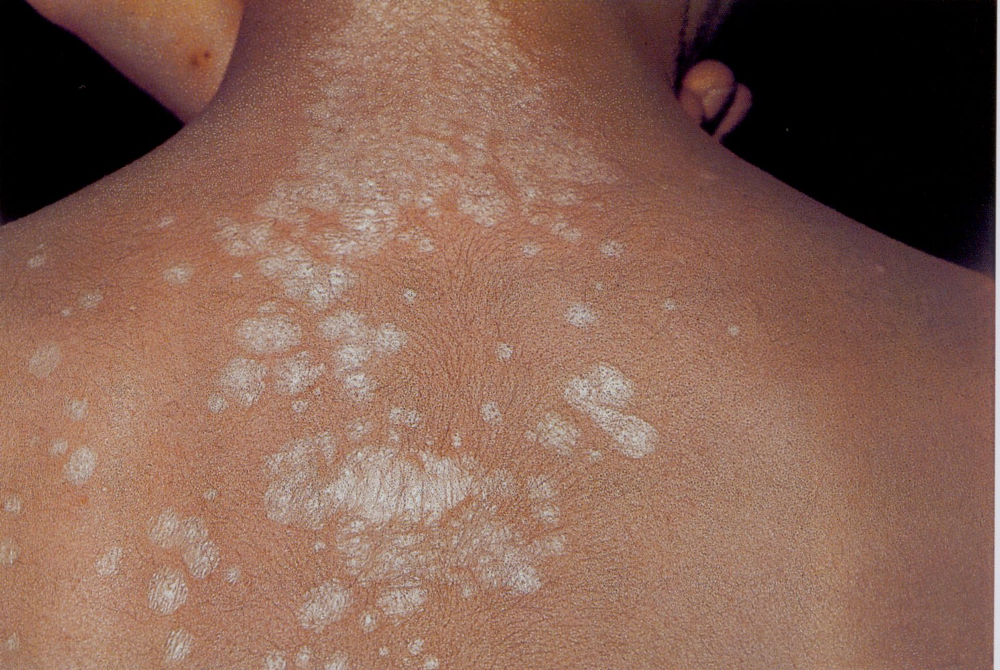
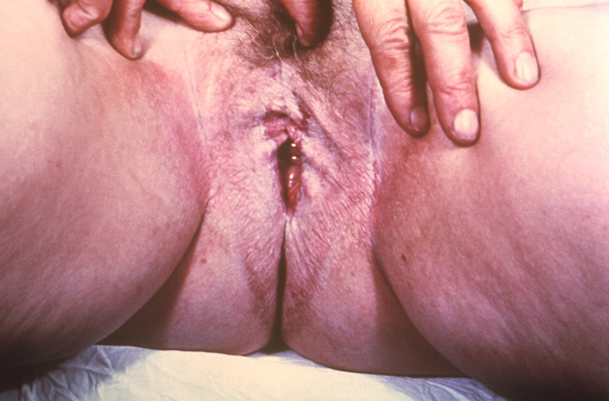
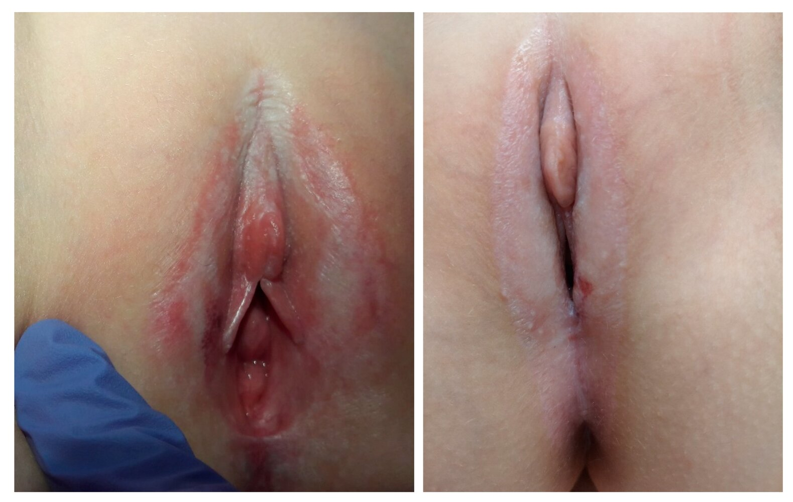
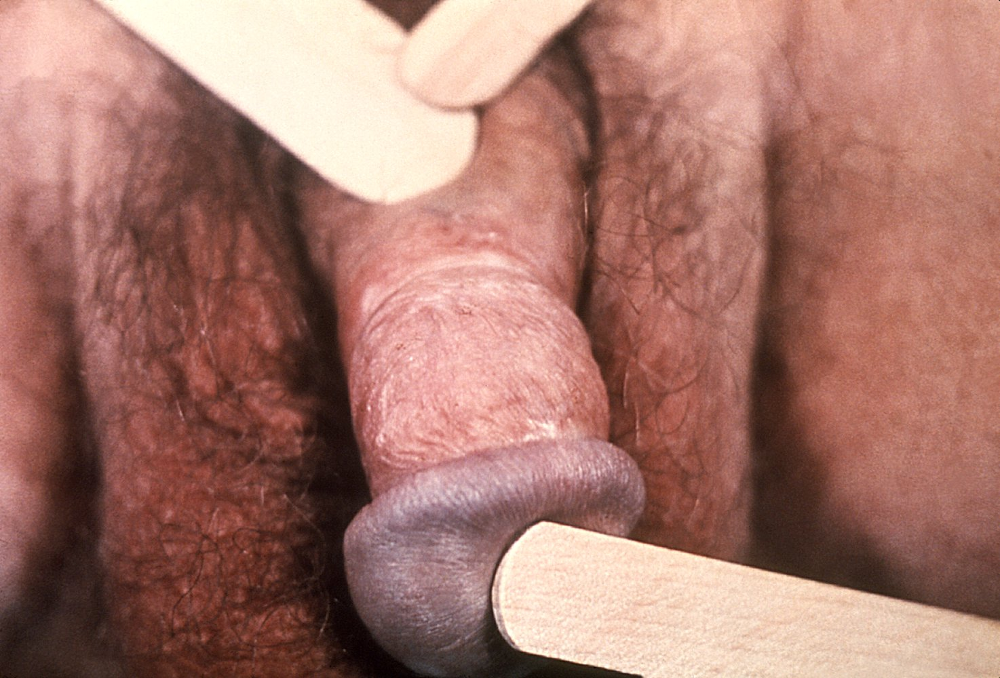

# Lichen sclerosus

*Categories: Clinical knowledge > Urology > Other urologic conditions > Lichen sclerosus*

[Original Article Link](https://coursology-qbank.com/amboss/article/j70_lh)

---

## Summary

Lichen sclerosus is a chronic inflammatory disease of unknown cause that is characterized by white, <u>atrophic</u> <u>plaques</u> with intense <u>pruritus</u> affecting the <u>skin</u>, <u>nails</u>, <u>hair</u>, and/or <u>mucous membranes</u>. It most commonly affects the anogenital area and women. Lichen sclerosus is <u>diagnosed clinically</u>. <u>Biopsy</u> is recommended in adult patients and in children with atypical lesions. First-line treatment is potent or <u>superpotent topical steroids</u>. Alternative treatments include intralesional <u>corticosteroids</u>, other topical pharmacotherapies (e.g., <u>calcineurin inhibitors</u>, <u>retinoids</u>), <u>phototherapy</u>, laser therapy, and <u>surgery</u>. Although the condition is benign, it is associated with an increased risk of <u>squamous cell carcinoma</u> (<u>SCC</u>) and requires lifelong monitoring.

---

## Epidemiology

* <u>Prevalence</u>: rare disease (occurs in < 2% of the female population) [[1]](https://coursology-qbank.com/amboss/article/8YcOIa0)

* Sex

* Females > males

* Most commonly affects (<u>perimenopausal</u> and <u>postmenopausal</u>) women [[1]](https://coursology-qbank.com/amboss/article/8YcOIa0)

* Mean age of onset: bimodal age distribution (possibly due to lower <u>estrogen</u> levels)

* Prior to <u>puberty</u> (mean of 5 years)

* During <u>perimenopause</u>/<u>menopause</u> (mean of 52 years)

Epidemiological data refers to the US, unless otherwise specified.

---

## Clinical features

### General features

* Description: well-demarcated, white <u>papules</u> and <u>plaques</u>, potentially with a surrounding red inflammatory halo

* Locations

* Anogenital (most common); in children may be confused with <u>child sexual abuse</u> [[3]](https://coursology-qbank.com/amboss/article/SidyIp0)[[4]](https://coursology-qbank.com/amboss/article/uUdpU60)[[5]](https://coursology-qbank.com/amboss/article/Od1IJf0)

* Extragenital, e.g., oral, back, shoulders, neck, wrists, thighs, and under the <u>breast</u> (rare in children)    [[4]](https://coursology-qbank.com/amboss/article/uUdpU60)

* Associated symptoms: severe <u>pruritus</u>, possibly <u>pain</u>/soreness

* Advanced disease: <u>ulceration</u>, hemorrhage, <u>lichenification</u>, <u>skin</u> thinning/fragility, and erosive scarring

### Anogenital involvement [[2]](https://coursology-qbank.com/amboss/article/N40-jT)

* Female genitalia  

* Figure-eight appearance involving the <u>vulva</u> and perianal area

* <u>Atrophic</u>, wrinkled appearance  [[6]](https://coursology-qbank.com/amboss/article/onW08N0)[[7]](https://coursology-qbank.com/amboss/article/Wk1P5S0)[[8]](https://coursology-qbank.com/amboss/article/5cci1Y0)

* May be associated with <u>dyspareunia</u>, <u>dysuria</u>, <u>labial adhesions</u>, clitoral phimosis, and narrowed introitus [[6]](https://coursology-qbank.com/amboss/article/onW08N0)

* Male genitalia

* Lesions on the <u>glans penis</u>

* May be associated with <u>phimosis</u> and <u>dysuria</u> (see “<u>Balanitis xerotica obliterans</u>”)

* Anal lesions may be associated with 

* <u>Anal fissures</u>

* Painful defecation with <u>secondary constipation</u> (especially in children)

Lichen sclerosus (et atrophicus)

Vulvar lichen sclerosus

Pediatric lichen sclerosus

Lichen sclerosus of preputial skin

---

## Diagnosis

* Diagnosis is usually clinical. [[6]](https://coursology-qbank.com/amboss/article/onW08N0)

* <u>Skin biopsy</u> (e.g., <u>punch biopsy</u>, <u>shave biopsy</u>)

* Indications

* All adults: to evaluate for <u>SCC</u> (e.g., <u>vulvar carcinoma</u>) and exclude differential diagnoses  [[6]](https://coursology-qbank.com/amboss/article/onW08N0)

* Diagnostic uncertainty: e.g., children with atypical lesions

* Findings: <u>epidermal</u> <u>atrophy</u>, <u>hyperkeratosis</u>, <u>dermal</u> <u>fibrosis</u>, and <u>sclerosis</u> [[9]](https://coursology-qbank.com/amboss/article/L9bwLD)

> [!TIP]
> <u>Biopsy</u> is not usually recommended for pediatric patients with classic <u>genital lesions</u>. [[3]](https://coursology-qbank.com/amboss/article/SidyIp0)[[4]](https://coursology-qbank.com/amboss/article/uUdpU60)[[6]](https://coursology-qbank.com/amboss/article/onW08N0)

---

## Treatment

### Approach [[4]](https://coursology-qbank.com/amboss/article/uUdpU60)[[6]](https://coursology-qbank.com/amboss/article/onW08N0)[[10]](https://coursology-qbank.com/amboss/article/cadajo0)

* Initiate <u>induction therapy</u>.

* Reassess in 1–3 months and titrate medications.  [[4]](https://coursology-qbank.com/amboss/article/uUdpU60)[[4]](https://coursology-qbank.com/amboss/article/uUdpU60)[[6]](https://coursology-qbank.com/amboss/article/onW08N0)

* Following remission (typically achieved in 3–6 months), start <u>maintenance therapy</u>.  [[4]](https://coursology-qbank.com/amboss/article/uUdpU60)[[6]](https://coursology-qbank.com/amboss/article/onW08N0)

* For persistent or worsening disease, refer to specialists (e.g., dermatology, gynecology, urology) for

* <u>Biopsy</u> of new or changing lesions to rule out <u>malignancy</u> [[4]](https://coursology-qbank.com/amboss/article/uUdpU60)[[6]](https://coursology-qbank.com/amboss/article/onW08N0)

* Consideration of advanced treatments [[6]](https://coursology-qbank.com/amboss/article/onW08N0)

### <u>Induction therapy</u> [[4]](https://coursology-qbank.com/amboss/article/uUdpU60)[[6]](https://coursology-qbank.com/amboss/article/onW08N0)[[10]](https://coursology-qbank.com/amboss/article/cadajo0)

There is no consensus regarding the induction of lichen sclerosus. Reevaluate every 1–3 months and titrate medications based on clinical response. [[4]](https://coursology-qbank.com/amboss/article/uUdpU60)[[6]](https://coursology-qbank.com/amboss/article/onW08N0)[[10]](https://coursology-qbank.com/amboss/article/cadajo0)

* First-line: Initiate a high-<u>potency</u> or <u>ultra-high potency topical steroid</u> ointment.  ;  [[3]](https://coursology-qbank.com/amboss/article/SidyIp0)[[4]](https://coursology-qbank.com/amboss/article/uUdpU60)[[6]](https://coursology-qbank.com/amboss/article/onW08N0)

* <u>Clobetasol</u> propionate 0.05% DOSAGE [[4]](https://coursology-qbank.com/amboss/article/uUdpU60)[[6]](https://coursology-qbank.com/amboss/article/onW08N0)[[10]](https://coursology-qbank.com/amboss/article/cadajo0)

* <u>Betamethasone</u> dipropionate 0.05% DOSAGE [[4]](https://coursology-qbank.com/amboss/article/uUdpU60)

* <u>Mometasone</u> furoate 0.1% DOSAGE [[4]](https://coursology-qbank.com/amboss/article/uUdpU60)

* Second-line options [[6]](https://coursology-qbank.com/amboss/article/onW08N0)

* Intralesional <u>corticosteroid</u> injections

* <u>Topical calcineurin inhibitors</u> (with caution): <u>tacrolimus</u>, <u>pimecrolimus</u>

> [!TIP]
> Ointments are preferred for their tolerance, <u>efficacy</u>, and barrier effects. [[4]](https://coursology-qbank.com/amboss/article/uUdpU60)

### <u>Maintenance therapy</u> [[4]](https://coursology-qbank.com/amboss/article/uUdpU60)[[6]](https://coursology-qbank.com/amboss/article/onW08N0)[[10]](https://coursology-qbank.com/amboss/article/cadajo0)

There is no consensus regarding the maintenance of lichen sclerosus. Titrate based on clinical response. [[4]](https://coursology-qbank.com/amboss/article/uUdpU60)

* Continue topical medications (e.g., <u>steroids</u>) at the lowest effective dose to maintain remission.  [[4]](https://coursology-qbank.com/amboss/article/uUdpU60)[[6]](https://coursology-qbank.com/amboss/article/onW08N0)

* Add <u>emollients</u>. [[7]](https://coursology-qbank.com/amboss/article/Wk1P5S0)[[8]](https://coursology-qbank.com/amboss/article/5cci1Y0)

* Monitor for the development of adverse effects (e.g., <u>atrophy</u>) and complications.  [[4]](https://coursology-qbank.com/amboss/article/uUdpU60)[[6]](https://coursology-qbank.com/amboss/article/onW08N0)[[10]](https://coursology-qbank.com/amboss/article/cadajo0)

> [!TIP]
> Although lichen sclerosus is a benign condition, continue lifelong <u>maintenance therapy</u> to maintain remission and monitor for <u>SCC</u>, e.g., <u>vulvar carcinoma</u>.  [[4]](https://coursology-qbank.com/amboss/article/uUdpU60)[[6]](https://coursology-qbank.com/amboss/article/onW08N0)[[10]](https://coursology-qbank.com/amboss/article/cadajo0)

### Advanced treatments [[6]](https://coursology-qbank.com/amboss/article/onW08N0)[[10]](https://coursology-qbank.com/amboss/article/cadajo0)

* Topical or oral <u>retinoids</u>

* Oral immunomodulators: <u>cyclosporine</u>, <u>methotrexate</u>

* Laser therapy or <u>phototherapy</u>

* <u>Surgery</u> in patients with adhesions, <u>phimosis</u> (penile or clitoral), or <u>malignancy</u>  [[4]](https://coursology-qbank.com/amboss/article/uUdpU60)[[5]](https://coursology-qbank.com/amboss/article/Od1IJf0)

> [!WARNING]
> <u>Vulvectomy</u> is not indicated for the <u>treatment of lichen sclerosus</u>. [[4]](https://coursology-qbank.com/amboss/article/uUdpU60)

---

## Complications

* Increased risk of <u>SCC</u>, e.g., <u>vulvar carcinoma</u> [[6]](https://coursology-qbank.com/amboss/article/onW08N0)

* Destructive scarring (may be prevented by <u>steroids</u>) [[6]](https://coursology-qbank.com/amboss/article/onW08N0)

We list the most important complications. The selection is not exhaustive.

---