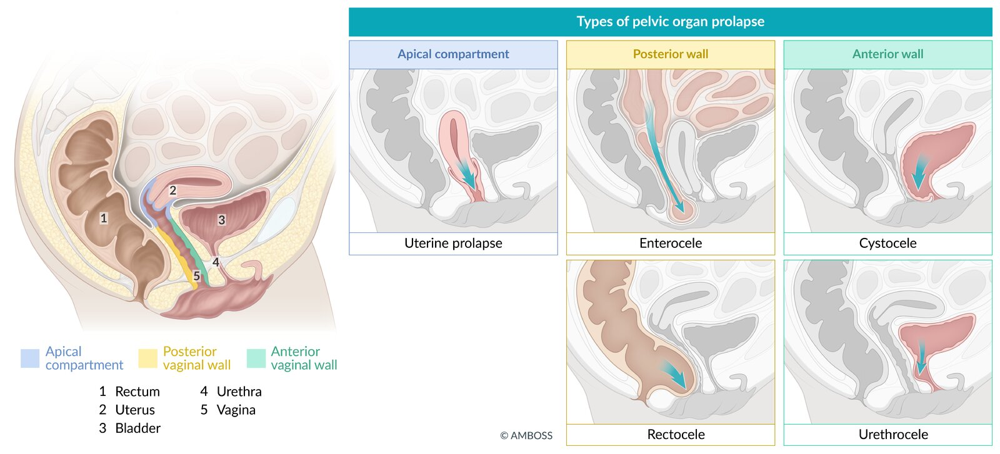
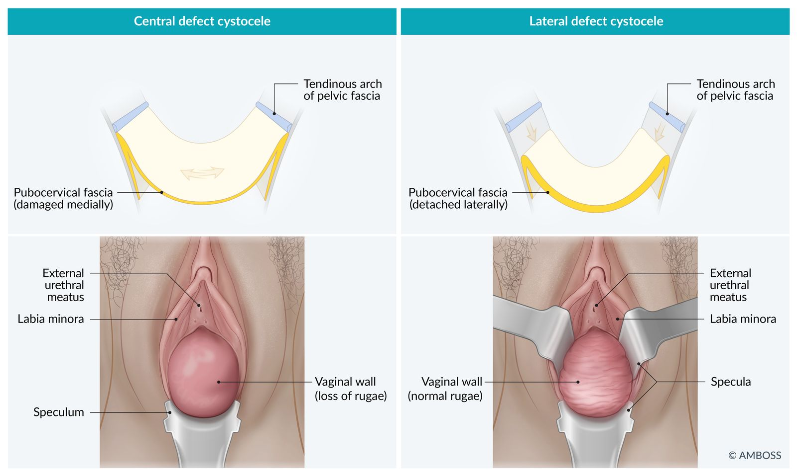

# Pelvic organ prolapse

*Categories: Clinical knowledge > Urology > Other urologic conditions > Pelvic organ prolapse*

[Original Article Link](https://coursology-qbank.com/amboss/article/nM076g)

---

## Summary

<u>Pelvic</u> organ prolapse (<u>POP</u>) is the protrusion of the <u>uterus</u>, vaginal apex, or surrounding <u>pelvic</u> structures (e.g., <u>bladder</u>, <u>rectum</u>) into the vaginal vault due to decreased <u>pelvic floor</u> support. It most commonly occurs in older adults. Other <u>risk factors</u> include <u>multiparity</u> (particularly vaginal births), prior <u>pelvic</u> <u>surgery</u>, <u>connective tissue disorders</u>, and increased <u>intra-abdominal pressure</u> secondary to <u>obesity</u> or chronic <u>constipation</u>. Manifestations include a sensation of pressure in the <u>vagina</u>, discomfort, and/or <u>pain</u>. Diagnosis is made with visualization of the prolapse on examination; diagnostic studies may be indicated to assess for complications. All patients should be offered <u>conservative management</u> to prevent progression. Symptomatic patients may also benefit from a <u>vaginal pessary</u>. <u>Surgery</u> is indicated for patients with symptomatic prolapse who do not respond to or decline <u>conservative management</u>. Complications of <u>POP</u> include urinary or fecal retention or incontinence, abdominal and/or <u>pelvic pain</u>, and <u>sexual dysfunction</u>.

---

## Overview

* Definition: <u>herniation</u> into or descent of <u>pelvic</u> organs to or beyond the vaginal walls

* Partial/subtotal prolapse: The <u>pelvic</u> organs are only partially outside the vaginal opening.

* Total prolapse: The <u>pelvic</u> organs are everted and located outside of the vaginal opening.

* Anatomical overview: The <u>pelvic floor</u> is supported by a continuous endopelvic <u>fascia</u>, which consists of: 

* Uterosacral ligament complex (suspends the <u>uterus</u> and vaginal apex from the <u>sacrum</u> and <u>lateral</u> <u>pelvis</u>)

* Paravaginal attachments

* <u>Perineal body</u>, <u>perineal membrane</u>, and the perineal muscles

* Specific sites  

* Vaginal wall prolapse

* <u>Anterior</u> <u>vaginal wall prolapse</u>: herniated <u>anterior</u> vaginal wall, which is often associated with a cystocele (descent of the <u>bladder</u> ; ) or urethrocele (descent of the <u>urethra</u>); can be due to <u>weakness</u> of the pubocervical <u>fascia</u>

* <u>Posterior</u> <u>vaginal wall prolapse</u>: herniated <u>posterior</u> vaginal wall, which is associated with a rectocele (descent of the <u>rectum</u>) or enterocele (herniated section of the intestines); can be due to <u>weakness</u> of the rectovaginal <u>fascia</u>

* Uterine prolapse: descent of the <u>uterus</u>

* Vaginal vault prolapse: descent of the apex of the <u>vagina</u>

* <u>Apical compartment prolapse</u>: herniated <u>uterus</u>, <u>cervix</u>, or vaginal vault

* Uterine procidentia: protrusion of all vaginal walls or <u>cervix</u> beyond the vaginal introitus

Layers of the pelvic floor

Types of pelvic organ prolapse

Cystocele

---

## Epidemiology

* <u>POP</u> is a common disorder in older women.  [[1]](https://coursology-qbank.com/amboss/article/gsdF8r0)

Epidemiological data refers to the US, unless otherwise specified.

---

## Etiology

* Etiology: : insufficiency of the <u>pelvic floor</u> muscles and the ligamentous supportive structure of the <u>uterus</u> and <u>vagina</u> (<u>low-tone pelvic floor dysfunction</u>)

* <u>Risk factors</u> [[2]](https://coursology-qbank.com/amboss/article/Lo1wc30)

* Older age

* Multiple vaginal deliveries and/or traumatic births (greatest <u>risk factor</u>)

* Low <u>estrogen</u> levels (e.g., during <u>menopause</u>)

* Increased <u>intra-abdominal pressure</u> (due to, e.g., <u>obesity</u>; , <u>cough</u> related to chronic <u>lung</u> disease and/or smoking, <u>ascites</u>, <u>pelvic</u> tumors, <u>constipation</u>)

* Previous <u>pelvic</u> <u>surgery</u> (e.g., <u>hysterectomy</u>)

* <u>Connective tissue disorders</u> (e.g., <u>Ehlers-Danlos syndrome</u>)

* <u>Diabetes mellitus</u>

---

## Clinical features

* Feeling of pressure on or discomfort around the <u>perineum</u> (“sensation of vaginal fullness”) [[2]](https://coursology-qbank.com/amboss/article/Lo1wc30)

* Lower back and <u>pelvic pain</u> (may become worse with prolonged standing or walking)

* Rectal fullness, <u>constipation</u>, incomplete rectal emptying

* Prolapse of the <u>anterior</u> (most common) or the <u>posterior</u> vaginal wall

* Occurs at rest and with increased abdominal pressure

* Possibly with excessive <u>vaginal discharge</u> on inspection, <u>bimanual examination</u>, and <u>speculum examination</u> of the patient in <u>lithotomy position</u>

* Weakened <u>pelvic floor</u> muscle and <u>anal sphincter tone</u>

* Urinary symptoms (e.g., <u>stress incontinence</u>, <u>overactive bladder</u>, <u>urinary retention</u>) [[2]](https://coursology-qbank.com/amboss/article/Lo1wc30)

* <u>Sexual dysfunction</u> (e.g., <u>dyspareunia</u>) [[3]](https://coursology-qbank.com/amboss/article/t5dXNq0)

> [!TIP]
> In addition to clinical features of <u>POP</u>, patients may also present with features associated with <u>pelvic floor dysfunction</u> (e.g., bowel or urinary symptoms, <u>dyspareunia</u>, <u>pelvic pain</u>).

---

## Differential diagnoses

### Elongation of the <u>cervix</u>

* An elongated <u>cervix</u> can be mistaken for a prolapse.

* Evaluated during <u>pelvic examination</u>

### Urethral diverticulum [[7]](https://coursology-qbank.com/amboss/article/6sdjDr0)

* Definition: a distinct outpouching of the urethral <u>mucosa</u> most often located posterolaterally in the mid and <u>distal</u> two-thirds of the <u>urethra</u>

* <u>Epidemiology</u>

* Rare

* Most commonly occurs in women (20–60 years of age)

* Etiology

* Acquired (most common)

* Recurrent infection of the periurethral glands

* <u>Pelvic</u> trauma (particularly involving the <u>vagina</u>, <u>bladder</u>, or <u>urethra</u>)

* Gynecological <u>surgery</u>, periurethral procedures

* Vaginal delivery

* Congenital

* Clinical features

* <u>Dysuria</u>

* <u>Dyspareunia</u>

* <u>Urinary incontinence</u> (particularly, postvoid dribbling of urine)

* Tender <u>anterior</u> vaginal wall mass during <u>pelvic examination</u>

* Diagnostics

* <u>MRI</u>

* <u>Transvaginal ultrasound</u> if <u>MRI</u> is not available/feasible

* <u>Urinalysis</u> to evaluate for other conditions (e.g., <u>urinary tract infection</u> or <u>malignancy</u>)

* Differential diagnosis
* Skene duct cyst

* A retention cyst that results from obstruction, accumulation of fluid, and cystic dilation of the ducts that drain the <u>paraurethral glands</u>.

* Manifests with <u>dysuria</u>, <u>dyspareunia</u>, and urinary <u>overflow incontinence</u>.

* <u>Pelvic examination</u> typically shows masses located just <u>lateral</u> to the <u>external urethral meatus</u>.

* Treatment

* <u>Conservative management</u>

* Indicated for individuals with minor symptoms

* Manual compression of the suburethral mass after voiding

* <u>Surgery</u>

* Indicated for individuals with persistent symptoms, <u>urinary calculi</u> in the diverticulum, or suspicion of <u>malignancy</u>

* Transvaginal <u>diverticulectomy</u>: is a preferred procedure

The differential diagnoses listed here are not exhaustive.

---

## Management

### Approach [[2]](https://coursology-qbank.com/amboss/article/Lo1wc30)[[3]](https://coursology-qbank.com/amboss/article/t5dXNq0)

* <u>Management of POP</u> depends on the stage and patient preference.

* Offer <u>conservative management</u> to all patients to prevent progression and reduce symptoms.

* Asymptomatic patients: regular review to monitor progression

* Symptomatic patients: Refer to a specialist for further management. 

* <u>Vaginal pessary</u> (preferred)

* <u>Surgery</u> (alternative)

> [!TIP]
> <u>POP</u> can cause <u>urethral obstruction</u>; advise patients that treatment may relieve the obstruction, unmasking <u>stress urinary incontinence</u>. [[4]](https://coursology-qbank.com/amboss/article/AHdRGr0)

### <u>Conservative management</u> [[2]](https://coursology-qbank.com/amboss/article/Lo1wc30)

* Lifestyle modifications to address <u>risk factors</u> and associated symptoms, e.g.:

* <u>Smoking cessation</u>

* <u>Weight management</u>, if indicated

* <u>Treatment of constipation</u>

* Avoidance of heavy lifting

* <u>Pelvic floor muscle training</u> (e.g., <u>Kegel exercises</u>)  [[2]](https://coursology-qbank.com/amboss/article/Lo1wc30)

### Vaginal pessary [[2]](https://coursology-qbank.com/amboss/article/Lo1wc30)[[3]](https://coursology-qbank.com/amboss/article/t5dXNq0)

* A silicone or latex device that is inserted into the <u>vagina</u> to provide support for <u>pelvic</u> organs

* Available in many shapes and sizes, selected based on symptoms and stage of <u>POP</u> [[2]](https://coursology-qbank.com/amboss/article/Lo1wc30)[[3]](https://coursology-qbank.com/amboss/article/t5dXNq0)

* Must be fitted by an appropriately trained clinician  [[8]](https://coursology-qbank.com/amboss/article/zHdrGr0)

* Requires regular cleaning to prevent complications (e.g., <u>pressure ulcers</u> and <u>erosions</u> into the <u>bladder</u> and/or <u>rectum</u>)  [[2]](https://coursology-qbank.com/amboss/article/Lo1wc30)[[8]](https://coursology-qbank.com/amboss/article/zHdrGr0)

* Patients able to clean the pessary: Follow up annually.

* Patients unable to clean the pessary: Follow up every 3 months.

> [!WARNING]
> <u>Bacterial vaginosis</u> occurs in one-third of patients who use a pessary. [[2]](https://coursology-qbank.com/amboss/article/Lo1wc30)

> [!TIP]
> Pessaries may not be suitable for patients with <u>dementia</u>, chronic <u>pelvic pain</u>, or <u>barriers to follow-up</u>. [[2]](https://coursology-qbank.com/amboss/article/Lo1wc30)

### <u>Surgery</u> [[3]](https://coursology-qbank.com/amboss/article/t5dXNq0)

* Indications for surgical referral include symptomatic prolapse in patients who do not respond to or do not want <u>conservative management</u>.

* Choice of surgical approach depends on factors such as:

* Location and severity of prolapse

* Associated symptoms

* Patient condition and preferences

#### Techniques

* Vaginal <u>hysterectomy</u>, with <u>vaginal apex suspension</u> and repair of <u>anterior</u> and <u>posterior</u> <u>vaginal wall prolapse</u> as necessary

* For patients wishing to avoid <u>hysterectomy</u>:

* Uterine suspension with <u>hysteropexy</u>

* Colpocleisis

* Surgical narrowing or closure of the <u>vagina</u>

* Can be considered for individuals who no longer wish to have vaginal sexual intercourse

> [!WARNING]
> Repair with synthetic mesh and/or grafting is no longer recommended for most individuals with <u>POP</u> because of the high risk of complications. [[3]](https://coursology-qbank.com/amboss/article/t5dXNq0)

> [!TIP]
> <u>Urethropexy</u> may be performed at the same time as <u>POP</u> <u>surgery</u> to prevent postoperative <u>stress incontinence</u>. [[9]](https://coursology-qbank.com/amboss/article/DbX1D9)

---

## Complications

### Urinary disorders [[10]](https://coursology-qbank.com/amboss/article/q_aC6M)

* <u>Stress incontinence</u>

* "Masked" <u>urinary incontinence</u>

* <u>Obstructive uropathy</u>

### <u>Defecation disorders</u>

* <u>Fecal incontinence</u>

* <u>Dyssynergic defecation</u>

### Other complications

* <u>Pressure ulcers</u> with hemorrhage

* Ascending infections (e.g., <u>cystitis</u>, <u>pyelonephritis</u>, vaginal and cervical infections, <u>endometritis</u>, <u>salpingitis</u>/adnexitis)

* <u>Pelvic pain</u>

* <u>Sexual dysfunction</u>

* Surgical complications (e.g., recurrence)

We list the most important complications. The selection is not exhaustive.

---