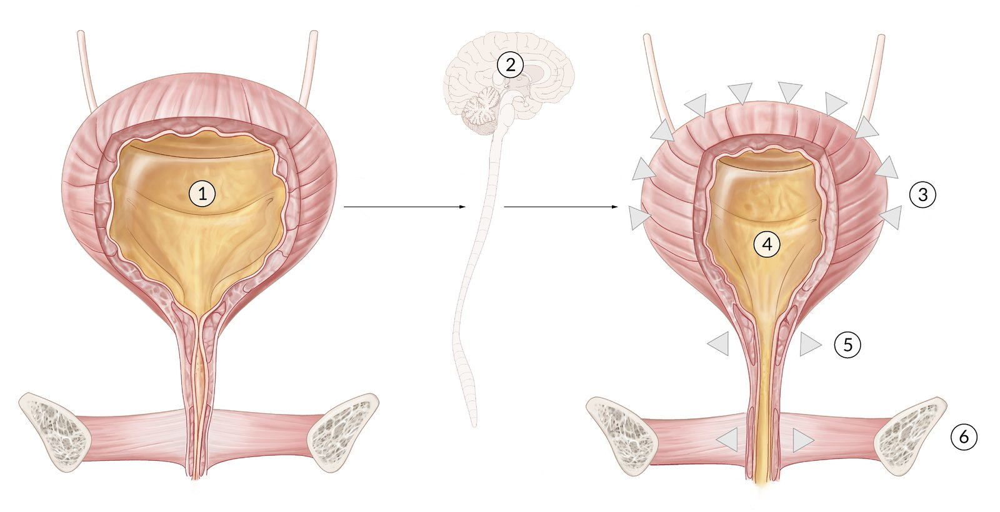
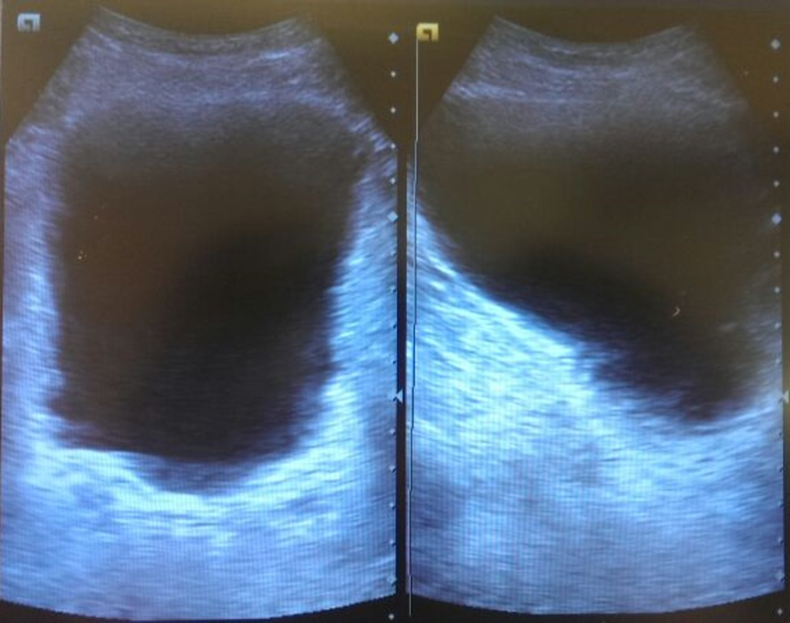
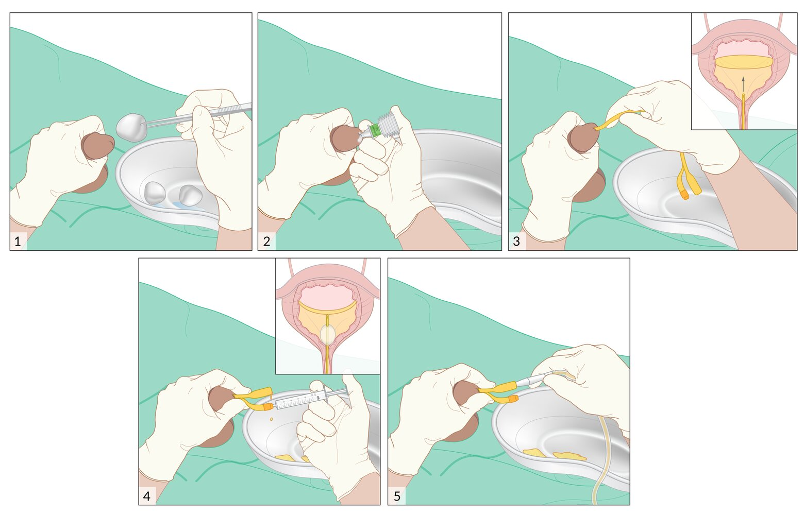
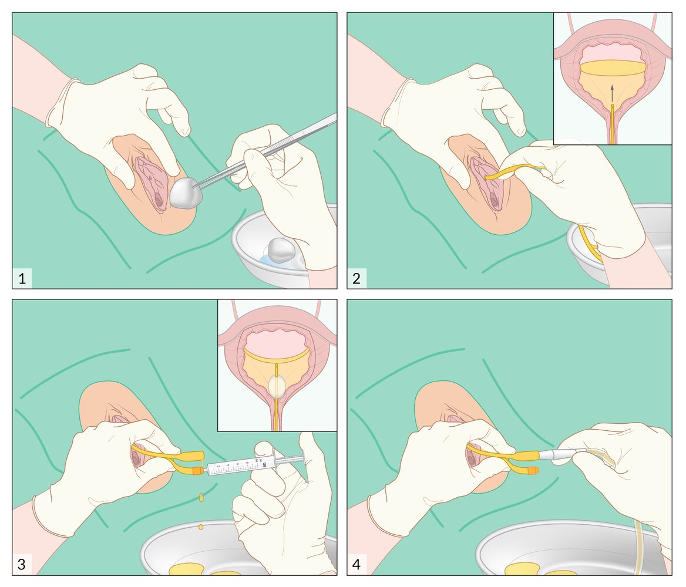

# Urinary retention

*Categories: Clinical knowledge > Urology > Urine retention and incontinence > Urinary retention*

[Original Article Link](https://coursology-qbank.com/amboss/article/Ci0qFf)

---

## Summary

Urinary retention is the inability to voluntarily empty the <u>bladder</u>. The cause can be either mechanical (e.g., <u>benign prostatic hyperplasia</u>, tumors, <u>urethral strictures</u>) or functional (e.g., <u>detrusor</u> underactivity due to <u>peripheral neuropathy</u>, <u>anticholinergic drugs</u>). Patients with <u>acute urinary retention</u> (<u>AUR</u>) present with a sudden, painful inability to void and a tender, distended <u>bladder</u> on palpation. Patients with <u>chronic urinary retention</u> (<u>CUR</u>) are typically unable to void completely but do not experience <u>pain</u>. <u>AUR</u> is usually <u>diagnosed clinically</u> and is considered a urological emergency. Therefore, urgent <u>bladder catheterization</u> should precede diagnostics. Diagnostics include <u>renal function tests</u> to assess for renal damage (<u>obstructive nephropathy</u>) and <u>ultrasound of the kidneys</u>, <u>ureter</u>, and <u>bladder</u> to identify the underlying cause and possible complications (e.g., <u>hydroureteronephrosis</u>). Further evaluation depends on the <u>patient history</u> and <u>physical examination</u>. Treating the underlying cause (e.g., with <u>alpha blockers</u> and/or <u>TURP</u> for <u>benign prostatic hyperplasia</u>) is essential to prevent recurrence and complications of urinary retention (e.g., <u>UTI</u>, <u>obstructive nephropathy</u>).

<u>Postoperative urinary retention</u> is detailed separately.

---

## Etiology

### Mechanical <u>bladder outlet obstruction</u> [[1]](https://coursology-qbank.com/amboss/article/DjX1cy)[[2]](https://coursology-qbank.com/amboss/article/AN1Rdh0)

#### <u>Bladder obstruction</u>

* <u>Bladder neck</u> obstruction

* <u>Bladder calculi</u>

* <u>Bladder cancer</u>

* <u>Urinary bladder tamponade</u>

* <u>Bladder injuries</u>

* <u>Blunt abdominal trauma</u>

* <u>Pelvic fractures</u>

* <u>Penetrating trauma</u>

* <u>Iatrogenic</u>: transurethral or <u>pelvic</u> <u>surgery</u>

#### <u>Urethral obstruction</u>

* Enlarged <u>prostate gland</u> 

* <u>Benign prostatic hyperplasia</u> (most common)

* <u>Prostate cancer</u>

* Acute <u>prostatitis</u> (rare)

* Urethral narrowing

* <u>Urethral stricture</u>

* <u>Posterior urethral valves</u>

* <u>Urethral carcinoma</u>

* <u>Urethritis</u>

* <u>Meatal stenosis</u> (rare)

* <u>Phimosis</u> and <u>paraphimosis</u>

* <u>Urethral injury</u> (e.g., urethral transection)

#### Extrinsic obstruction

* <u>Anterior</u> <u>vaginal wall prolapse</u> (e.g., <u>cystocele</u>, <u>urethrocele</u>)

* <u>Pelvic</u> mass (e.g., <u>malignancy</u>, <u>fibroids</u>, <u>endometriosis</u>)

* Rectal mass

* <u>Fecal impaction</u>

### Functional <u>bladder outlet obstruction</u>

#### Neurogenic lower urinary tract dysfunction (<u>neurogenic bladder</u>) [[3]](https://coursology-qbank.com/amboss/article/aJWQsm0)[[4]](https://coursology-qbank.com/amboss/article/YJWnsm0)[[5]](https://coursology-qbank.com/amboss/article/x3WEkO0)

<u>Neurogenic lower urinary tract dysfunction</u> is caused by disruption in the innervation of the <u>detrusor</u> and/or <u>urethral sphincter</u> and is commonly classified by anatomical location.

* Suprasacral <u>spinal cord lesion</u>: <u>spinal cord lesion</u> at or above L1 → detrusor-sphincter dyssynergia with simultaneous contractions of the <u>detrusor muscle</u> and involuntary activation of the urethral sphincter → urinary retention and/or <u>urge incontinence</u> (spastic neurogenic bladder)

* <u>Spinal cord compression</u> (e.g., <u>spinal disc herniation</u>, <u>spinal epidural abscess</u>, <u>tumor</u>, trauma)

* Congenital anomalies of the spinal cord (e.g., <u>meningomyelocele</u>, <u>spina bifida</u>)

* Other conditions involving <u>upper motor neurons</u> (e.g., <u>multiple sclerosis</u>, <u>transverse myelitis</u>)

* Sacral or infrasacral lesions: peripheral nerve damage or <u>spinal cord lesion</u> below L1→ <u>detrusor</u> underactivity with normal or reduced <u>urethral sphincter</u> tone → urinary retention and <u>overflow incontinence</u> (flaccid neurogenic bladder)

* Lesions involving the <u>conus medullaris</u> or <u>cauda equina</u> (e.g., due to trauma, <u>tumor</u>, infection)

* Damage to <u>pelvic splanchnic nerves</u> (e.g., due to <u>diabetic autonomic neuropathy</u>, <u>pelvic</u> trauma, <u>pelvic</u> radiation)

* Suprapontine lesion: <u>brain</u> lesion above the <u>pons</u> → disruption in the inhibition of the <u>pontine</u> <u>micturition</u> center → involuntary <u>detrusor</u> contractions → <u>urinary incontinence</u> without urinary retention

* <u>Cerebrovascular disease</u>

* <u>Neurodegenerative disease</u> (e.g., <u>Parkinson disease</u>, <u>dementia</u>)

* Other <u>brain lesions</u> (e.g. tumors)

#### Drug-induced urinary retention [[1]](https://coursology-qbank.com/amboss/article/DjX1cy)[[6]](https://coursology-qbank.com/amboss/article/IcaYdj)

* Due to drugs that decrease <u>detrusor</u> activity, e.g.: 

* Drugs with <u>anticholinergic</u> effects (e.g., <u>first-generation antihistamines</u>, <u>tricyclic antidepressants</u>, <u>antipsychotics</u>, antiparkinson agents, <u>antispasmodics</u>)

* <u>Calcium channel blockers</u>

* <u>NSAIDs</u>

* Due to drugs that increase <u>urethral sphincter</u> tone, e.g.: 

* <u>Sympathomimetics</u> (e.g., <u>phenylephrine</u>, <u>pseudoephedrine</u>)

* <u>Opioids</u>

#### Other

* Primary bladder neck obstruction: an <u>idiopathic</u> functional disorder characterized by failure of the <u>bladder neck</u> to open completely during <u>micturition</u> [[7]](https://coursology-qbank.com/amboss/article/rtWfUM0)

* <u>Postoperative urinary retention</u>

* <u>Postpartum urinary retention</u>

Urinary bladder (male)

Urinary bladder (female)

Micturition

---

## Clinical features

| Acute vs. <u>chronic urinary retention</u> |  |  |
| --- | --- | --- |
|  | Acute urinary retention | Chronic urinary retention |
| Etiology |   * Obstructive etiologies are more common (esp. <u>BPH</u>).  * Some factors (e.g., <u>alcohol</u>-induced diuresis, <u>spinal anesthesia</u>, <u>pelvic</u> <u>surgery</u>, certain drugs, <u>UTI</u>) can precipitate acute-on-<u>chronic urinary retention</u>. [[8]](https://coursology-qbank.com/amboss/article/rA0fOi)    |  * Functional or a gradually progressive mechanical obstruction (e.g., <u>BPH</u>, <u>urinary tract cancer</u>)   |
| Clinical features |   * More common in men, esp. > 70 years of age  [[8]](https://coursology-qbank.com/amboss/article/rA0fOi)  * Sudden onset  * Painful inability to void  * Suprapubic <u>pain</u>/discomfort  * Palpable <u>bladder</u>  * Patient is restless and distressed.    |   * <u>♂</u> > <u>♀</u>  * Painless incomplete voiding of the <u>bladder</u>  [[9]](https://coursology-qbank.com/amboss/article/4Aa3PM)  * Palpable <u>bladder</u> may be present.  * May present with <u>overflow incontinence</u> or <u>nocturnal enuresis</u>  [[8]](https://coursology-qbank.com/amboss/article/rA0fOi)    |
| <u>Physical examination</u> |   * Abdominal and <u>pelvic examination</u>: <u>urethra</u> (for discharge/<u>meatal stenosis</u>), <u>prepuce</u> (retractability), vaginal examination (evaluation for a <u>pelvic</u> mass)  * <u>Digital rectal exam</u> (<u>DRE</u>): to evaluate <u>prostate</u> size and tenderness, detect a rectal mass or <u>fecal impaction</u>, assess sphincter tone  * Complete <u>neurological examination</u>    |  |

---

## Initial management

### Approach [[1]](https://coursology-qbank.com/amboss/article/DjX1cy)[[2]](https://coursology-qbank.com/amboss/article/AN1Rdh0)

* Confirm <u>acute urinary retention</u>.

* Palpable <u>bladder</u> on <u>physical examination</u>

* And/or distended <u>bladder</u> on <u>POCUS</u> or <u>bladder scanner</u>

* Perform urgent <u>bladder catheterization</u>.

* <u>Urethral catheterization</u> with a <u>Foley catheter</u>

* In male patients, consider <u>coude catheter</u> placement if the <u>Foley catheter</u> fails.

* If <u>urethral catheterization</u> fails, consult urology and consider <u>suprapubic catheterization</u>.

* Obtain initial diagnostics for urinary retention (i.e., <u>urinalysis</u>, <u>urine culture</u>, <u>BMP</u>).

* Perform additional diagnostics as indicated.

* Initiate treatment of the underlying cause, e.g., <u>pharmacotherapy for BPH</u>.  [[10]](https://coursology-qbank.com/amboss/article/I8WYLM0)

> [!WARNING]
> In patients with <u>pelvic</u> or perineal trauma or a prior history of <u>urethral strictures</u>, consider immediate urology consult before attempting <u>bladder catheterization</u>. [[1]](https://coursology-qbank.com/amboss/article/DjX1cy)

> [!TIP]
> Rapid and complete <u>bladder</u> decompression is recommended for all patients with <u>AUR</u>, as gradual decompression has not been shown to prevent complications. [[2]](https://coursology-qbank.com/amboss/article/AN1Rdh0)[[11]](https://coursology-qbank.com/amboss/article/PZcWba0)

Distended bladder

Transurethral catheterization of the penis

Transurethral catheterization of the vulva

### Disposition [[1]](https://coursology-qbank.com/amboss/article/DjX1cy)[[2]](https://coursology-qbank.com/amboss/article/AN1Rdh0)

* Consider hospital admission for patients with significant comorbidities, neurological deficits, <u>obstructive nephropathy</u>, or <u>UTI</u>.

* Discharge otherwise healthy patients with an indwelling catheter and arrange an outpatient voiding trial 3–7 days later.  [[2]](https://coursology-qbank.com/amboss/article/AN1Rdh0)

* Refer patients to urology within 2–3 weeks if: [[1]](https://coursology-qbank.com/amboss/article/DjX1cy)

* Voiding trial is unsuccessful

* <u>Lower urinary tract symptoms</u> (e.g., hesitancy) were present prior to <u>AUR</u>

---

## Diagnosis

> [!WARNING]
> If clinical features of <u>AUR</u> are present, perform urgent <u>bladder catheterization</u> before obtaining diagnostic studies. [[1]](https://coursology-qbank.com/amboss/article/DjX1cy)[[2]](https://coursology-qbank.com/amboss/article/AN1Rdh0)

### Clinical evaluation [[1]](https://coursology-qbank.com/amboss/article/DjX1cy)

Obtain a thorough history, and perform a comprehensive <u>physical examination</u>, including:

* Complete <u>abdominal examination</u> with palpation and percussion to assess for <u>bladder</u> fullness

* <u>Neurological examination</u> to evaluate for sensorimotor deficits in the lumbosacral region

### Bedside <u>bladder</u> imaging [[1]](https://coursology-qbank.com/amboss/article/DjX1cy)[[2]](https://coursology-qbank.com/amboss/article/AN1Rdh0)

* <u>Bladder scanner</u> or <u>bladder POCUS</u> to confirm urinary retention and assess <u>postvoid residual volume</u> (<u>PVR</u>)

* <u>AUR</u>: no <u>PVR</u> cutoff for diagnostic confirmation

* <u>CUR</u>: <u>PVR</u> > 300 mL present on ≥ 2 separate occasions over a period of > 6 months suggests <u>chronic urinary retention</u>. [[9]](https://coursology-qbank.com/amboss/article/4Aa3PM)

* If <u>PVR</u> cannot be measured: Consider <u>bladder catheterization</u> and measurement of drained urine. [[1]](https://coursology-qbank.com/amboss/article/DjX1cy)

Distended bladder

### <u>Laboratory studies</u> [[1]](https://coursology-qbank.com/amboss/article/DjX1cy)[[2]](https://coursology-qbank.com/amboss/article/AN1Rdh0)

* <u>Urinalysis</u> and <u>urine culture</u>: to evaluate for <u>UTI</u>, <u>hematuria</u>, <u>glycosuria</u>, and crystals

* <u>Basic metabolic panel</u>: to evaluate for <u>obstructive nephropathy</u> and <u>electrolyte</u> abnormalities

### Additional diagnostics [[1]](https://coursology-qbank.com/amboss/article/DjX1cy)

Additional diagnostics should be obtained in consultation with urology to confirm the diagnosis, determine the <u>etiology of urinary retention</u>, and rule out differential diagnoses.

* <u>Laboratory studies</u>, e.g.:

* <u>HbA1c</u> for suspected diabetic <u>neurogenic bladder</u>

* Serum <u>PSA</u> levels for suspected <u>prostate cancer</u>  [[12]](https://coursology-qbank.com/amboss/article/KH0Urh)

* Imaging, e.g.:

* <u>Renal and bladder ultrasound</u> to evaluate for <u>hydroureteronephrosis</u>, <u>BPH</u>, and <u>bladder calculi</u>

* <u>Transrectal ultrasound</u> to evaluate for <u>prostate cancer</u>

* <u>Pelvic</u> <u>ultrasound</u> and/or CT abdomen and <u>pelvis</u> to evaluate for extrinsic <u>bladder neck</u> compression

* <u>MRI</u> <u>brain</u> and/or <u>spine</u> to evaluate for neurological causes

* <u>Cystoscopy</u> with <u>urine cytology</u> for suspected <u>bladder cancer</u>

* See also “<u>Imaging techniques in urology</u>.”

* <u>Urodynamic studies</u>, e.g., <u>uroflowmetry</u> to assess <u>bladder</u> function

---

## Treatment

Treatment of the underlying cause is indicated for <u>AUR</u> and <u>CUR</u>. For immediate management of <u>AUR</u> and urgent <u>bladder</u> decompression, see “<u>Initial management of acute urinary retention</u>.” See also “<u>Postoperative urinary retention</u>” as needed.

### Mechanical <u>bladder outlet obstruction</u>

* Enlarged <u>prostate gland</u>

* <u>Benign prostatic hyperplasia</u>: <u>treatment of BPH</u> (e.g., <u>alpha blockers</u>, <u>TURP</u>)

* <u>Prostatitis</u>: <u>empiric antibiotics for prostatitis</u> (e.g., <u>ciprofloxacin</u>)

* <u>Prostate cancer</u>: <u>management of prostate cancer</u>

* Urethral narrowing: Refer to urology for management (e.g., <u>meatotomy</u> for <u>meatal stenosis</u>, <u>balloon dilation</u> for <u>urethral stricture</u>).

* Other obstructive etiologies: See “<u>Treatment of urinary tract obstruction</u>.”

### Functional <u>bladder outlet obstruction</u>

* <u>Neurogenic lower urinary tract dysfunction</u>  [[5]](https://coursology-qbank.com/amboss/article/x3WEkO0)[[13]](https://coursology-qbank.com/amboss/article/ErW8Q50)[[14]](https://coursology-qbank.com/amboss/article/vrWAQ50)[[15]](https://coursology-qbank.com/amboss/article/-NdDdq0)

* Guided by patient and/or caregiver preference

* Storage dysfunction

* <u>Pelvic floor physical therapy</u>

* <u>Behavioral therapy</u>: <u>bladder training</u> with <u>timed voiding</u>

* Pharmacotherapy

* <u>Antimuscarinic agents</u>: reduce neurogenic <u>detrusor</u> overactivity

* <u>Beta-3 agonists</u> may be useful in improving storage parameters.

* <u>Desmopressin</u>: temporarily reduces <u>urine production</u> to manage <u>nocturia</u>

* Voiding dysfunction

* Intermittent self-catheterization 4–6 times a day with a 12–14 Fr catheter

* Pharmacotherapy: <u>alpha blockers</u>

* Further management may include

* Minimally invasive interventions

* Surgical management  [[16]](https://coursology-qbank.com/amboss/article/lXXvy9)

* <u>Drug-induced urinary retention</u>: Discontinue or substitute the precipitating drug.

* <u>Postoperative urinary retention</u>: See “<u>Postoperative urinary retention</u>.”

* <u>Primary bladder neck obstruction</u>: Refer to urology for management (e.g., with <u>alpha blockers</u>, surgical <u>incision</u> of the <u>bladder neck</u>).

---

## Complications

### Complications of urinary retention

* <u>Acute urinary retention</u>: <u>renal failure</u> (<u>acute kidney injury</u> or <u>obstructive nephropathy</u>)

* <u>Chronic urinary retention</u>

* <u>Vesicoureteric reflux</u> → <u>hydronephrosis</u> → <u>renal failure</u>

* <u>UTI</u>

* <u>Urolithiasis</u>

* <u>Overflow incontinence</u>

### Complications of <u>bladder</u> decompression [[2]](https://coursology-qbank.com/amboss/article/AN1Rdh0)

Complications of <u>bladder</u> decompression via catheterization are rare and usually <u>self-limiting</u>.

#### Postobstructive diuresis [[17]](https://coursology-qbank.com/amboss/article/yJWd9m0)

* Definition: a <u>polyuric</u> state resulting from the rapid <u>renal elimination</u> of accumulated water and <u>electrolytes</u> after relief of <u>urinary tract obstruction</u>

* Etiology: typically occurs following relief of <u>bladder outlet obstruction</u> or bilateral <u>ureteral obstruction</u>

* Diagnostics

* > 200 mL/hour urine produced for 2 hours

* OR > 3 L urine produced in 24 hours

* Management

* <u>Self-limited</u>; lasts ∼ 24 hours

* Encourage oral hydration.

* Consider admission for <u>IV fluids</u> if patients are unable to orally hydrate.

* Complications: <u>dehydration</u>, <u>electrolyte</u> imbalance, <u>hypovolemia</u>

#### Other complications of decompression

* <u>Hematuria</u>  [[11]](https://coursology-qbank.com/amboss/article/PZcWba0)

* Transient <u>hypotension</u>

We list the most important complications. The selection is not exhaustive.

---