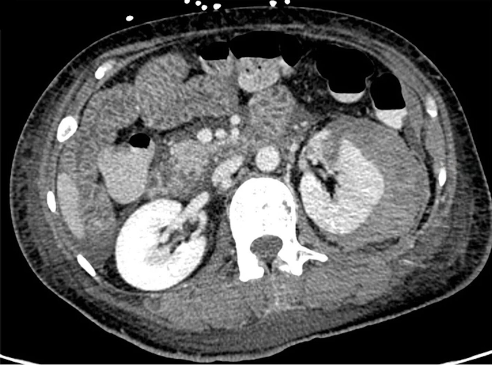
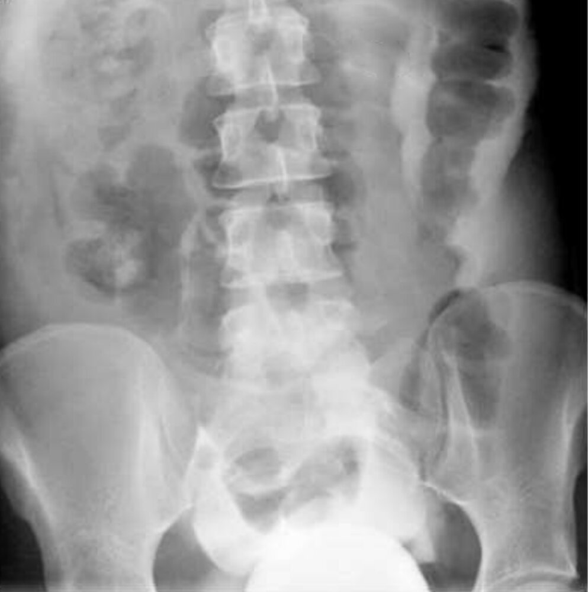
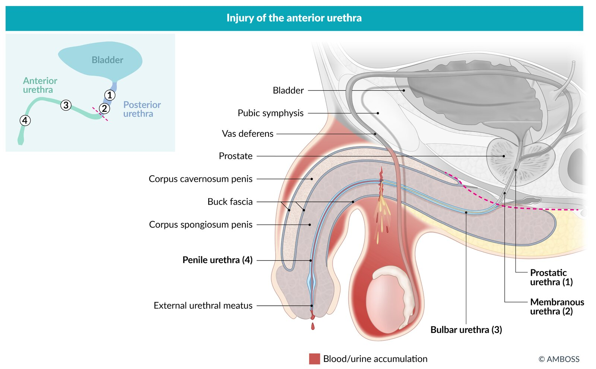
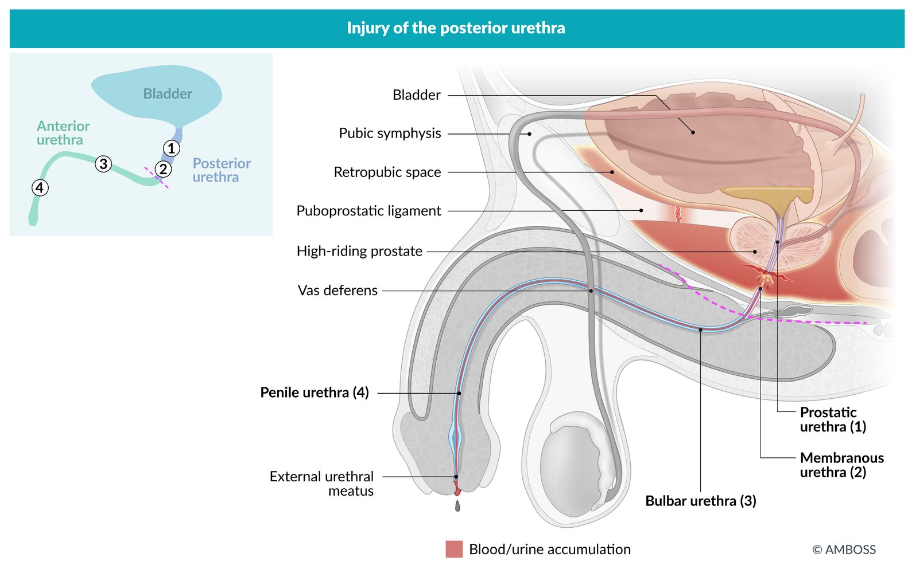

# Genitourinary trauma

*Categories: Clinical knowledge > Urology > Urologic emergencies > Genitourinary trauma*

[Original Article Link](https://coursology-qbank.com/amboss/article/9i0NFf)

---

## Summary

Genitourinary trauma includes injury to the <u>kidneys</u>, <u>ureters</u>, <u>bladder</u>, <u>urethra</u>, and genitals, and is associated with a high level of <u>morbidity</u> if not properly identified and managed. Classic symptoms include abdominal <u>pain</u> and <u>hematuria</u>. Diagnosis is typically based on <u>patient history</u>, <u>physical examination</u>, <u>urinalysis</u>, and imaging (e.g., CT, <u>cystoscopy</u>, <u>retrograde urethrography</u>). Management is based on the type of injury and concomitant trauma. Unstable patients with genitourinary trauma may require emergency surgical interventions such as <u>exploratory laparotomy</u>. <u>Renal trauma</u> is most commonly caused by <u>blunt abdominal trauma</u>, and mild <u>renal injuries</u> can often be <u>treated conservatively</u>. <u>Ureteral injuries</u> are often <u>iatrogenic</u> and may require <u>stent</u> placement and/or surgical repair. <u>Bladder injuries</u> are common in <u>blunt abdominal trauma</u>, and treatment differs for <u>intraperitoneal</u> <u>bladder rupture</u> and extraperitoneal <u>bladder rupture</u>. <u>Genital injury</u> may be caused by blunt or <u>penetrating trauma</u>, including <u>sexual assault</u>. Treatment depends on the type and severity of <u>genital injury</u>. <u>Complications of genitourinary trauma</u> include <u>urinary extravasation</u>, <u>urinoma</u>, <u>abscess</u> formation, <u>renal hypertension</u>, and loss of function in the affected <u>kidney</u>.

---

## Renal injuries

### Types of injuries [[3]](https://coursology-qbank.com/amboss/article/OrWIh50)[[4]](https://coursology-qbank.com/amboss/article/74c4kc0)

* Renal laceration: a tear in <u>kidney</u> tissue; may lead to <u>urinary extravasation</u> and/or bleeding

* Renal hematoma: a collection of blood within the renal <u>parenchyma</u>

* Renal vascular injury: <u>renal vein</u> or <u>artery</u> injury leading to active bleeding, <u>thrombosis</u>, and/or devascularization

* Hilar <u>avulsion injury</u>: shearing of the <u>renal hilum</u>; can lead to complete devascularization and profuse bleeding

### Etiology

* <u>Blunt trauma</u> (up to 95% of cases) [[5]](https://coursology-qbank.com/amboss/article/wIWhU50)

* <u>Blunt abdominal trauma</u>, e.g., <u>acceleration/deceleration injury</u> due to <u>motor vehicle collisions</u> or falls

* <u>Blunt thoracic trauma</u>, e.g., blows to the torso: associated with lower <u>rib</u> (9th–12th) <u>fractures</u>   [[6]](https://coursology-qbank.com/amboss/article/wUYh2o)

* <u>Penetrating trauma</u> (e.g., gunshot or <u>stab wounds</u>)

Kidneys, lungs, and liver within thoracic skeleton

### Clinical features [[2]](https://coursology-qbank.com/amboss/article/AN1Rdh0)

* <u>Pain</u>, <u>bruising</u>, <u>hematoma</u> on the affected side

* <u>Hematuria</u>

* Accompanying injuries (e.g., <u>rib fracture</u>)

* <u>Hemorrhagic shock</u>

* Abdominal distention or palpable mass

### Diagnostics [[2]](https://coursology-qbank.com/amboss/article/AN1Rdh0)[[3]](https://coursology-qbank.com/amboss/article/OrWIh50)[[5]](https://coursology-qbank.com/amboss/article/wIWhU50)[[7]](https://coursology-qbank.com/amboss/article/l4Wvjl0)

* Follow the <u>approach to genitourinary trauma</u>.

* If the patient is unstable, actively bleeding, and/or requires emergency <u>surgery</u>, perform an <u>emergency preoperative evaluation</u>.

* See “<u>Urgent diagnostics for trauma patients</u>” for a general list applicable to all <u>trauma patients</u>.

#### <u>Laboratory studies</u>

* <u>Urinalysis</u>: <u>macroscopic hematuria</u> or <u>microscopic hematuria</u>

* The type or severity of <u>hematuria</u> does not correlate with injury type or severity.

* <u>Microscopic hematuria</u> after significant nongenitourinary trauma is common.

* <u>Creatinine</u>: to establish baseline renal function  [[2]](https://coursology-qbank.com/amboss/article/AN1Rdh0)

#### Imaging

* Indications (in addition to <u>general indications for imaging in GU trauma</u>)

* <u>Gross hematuria</u> after <u>blunt trauma</u>

* Injury pattern consistent with possible <u>renal injury</u> (e.g., lower <u>rib fractures</u>, flank <u>ecchymosis</u>)

* Modalities and findings

* CT with IV contrast of the abdomen/<u>pelvis</u> (<u>gold standard</u>) 

* To assess for renal and accompanying injuries or intraabdominal fluid retention

* See “Classification” for imaging findings.

* Delayed-phase CT imaging: to assess for injury to the <u>renal pelvis</u> and/or <u>ureters</u>

Renal laceration

#### Classification [[4]](https://coursology-qbank.com/amboss/article/74c4kc0)

Based on imaging findings, <u>renal injuries</u> are usually classified using the American Association for the <u>Surgery</u> of Trauma (<u>AAST</u>) grading system for traumatic <u>renal injury</u>.

* Low-grade <u>renal injuries</u> (grade I–III)

* Subcapsular or perirenal <u>hematoma</u> within <u>Gerota fascia</u>

* <u>Renal laceration</u> without <u>urinary extravasation</u> or vascular injury

* High-grade <u>renal injuries</u> (grade IV–V)

* Vascular injury with active bleeding or devascularization

* Renal and ureteropelvic injuries with <u>urinary extravasation</u>

* Avulsion of the <u>renal hilum</u>

* Unidentifiable renal anatomy (shattered <u>kidney</u>)

### Treatment [[5]](https://coursology-qbank.com/amboss/article/wIWhU50)[[7]](https://coursology-qbank.com/amboss/article/l4Wvjl0)[[8]](https://coursology-qbank.com/amboss/article/GHWB750)

#### <u>Hemodynamically unstable</u> patients

* <u>IV fluid resuscitation</u> and <u>emergency transfusion</u> if necessary

* Initiate urgent intervention: <u>exploratory laparotomy</u> or <u>angioembolization</u> (for selected patients)   [[5]](https://coursology-qbank.com/amboss/article/wIWhU50)

#### Hemodynamically stable patients

* Admit for observation with <u>hemodynamic monitoring</u>, bed rest, and <u>supportive care</u>.

* Serial <u>laboratory studies</u>

* Ensure adequate urinary drainage (e.g., <u>ureteral stent</u> placement, percutaneous drainage).

* Consider <u>angioembolization</u> for bleeding in consultation with urology.

* Re-imaging in cases of clinical deterioration and high-grade injuries

### Disposition [[2]](https://coursology-qbank.com/amboss/article/AN1Rdh0)

* Determine disposition in consultation with trauma <u>surgery</u> and urology.

* Admit patients with <u>renal injuries</u> for observation.

---

## Ureteral injuries

### Types of injuries [[3]](https://coursology-qbank.com/amboss/article/OrWIh50)[[9]](https://coursology-qbank.com/amboss/article/A7WRo50)

* Ureteral laceration: injury of the <u>ureter</u> with incomplete transection; ranges from pinpoint defects to large openings

* Ureteral avulsion

* Traumatic shearing of the <u>ureter</u> causing ureteral discontinuity

* Can occur during <u>ureteroscopy</u>, most commonly due to instruments that are too large for the <u>ureter</u> or attempted removal of insufficiently fragmented stones [[10]](https://coursology-qbank.com/amboss/article/38cSmV0)

* Others: complete transection, <u>hematoma</u>, or <u>contusion</u>, ligation or <u>thermal injury</u>

### Etiology [[3]](https://coursology-qbank.com/amboss/article/OrWIh50)

* Most common: <u>iatrogenic</u> (e.g., <u>ureteral avulsion</u> during <u>ureteroscopy</u>, intraoperative <u>ureteral laceration</u> or ligation) [[3]](https://coursology-qbank.com/amboss/article/OrWIh50)

* <u>Penetrating trauma</u> (e.g., gunshot or <u>stab wounds</u>)

* <u>Blunt abdominal trauma</u> (e.g., deceleration injuries, blows to the torso, <u>pelvic fractures</u>) [[11]](https://coursology-qbank.com/amboss/article/XrW9f50)

### Clinical features [[2]](https://coursology-qbank.com/amboss/article/AN1Rdh0)

Nonspecific as they often occur with multisystem injuries

* <u>Features of genitourinary trauma</u>, e.g., <u>hematuria</u>

* <u>Features of sepsis</u> (due to <u>urinary extravasation</u>)

* Features of commonly associated injuries, e.g., <u>vertebral fractures</u>, <u>pelvic fractures</u>

> [!WARNING]
> Maintain a high level of suspicion for <u>ureteral injuries</u> in patients with high-energy <u>blunt trauma</u> or <u>penetrating abdominal trauma</u> as they are often overlooked. [[11]](https://coursology-qbank.com/amboss/article/XrW9f50)

### Diagnostics [[2]](https://coursology-qbank.com/amboss/article/AN1Rdh0)[[7]](https://coursology-qbank.com/amboss/article/l4Wvjl0)[[11]](https://coursology-qbank.com/amboss/article/XrW9f50)

* Follow the <u>approach to genitourinary trauma</u>.

* If the patient is unstable, actively bleeding, and/or requires emergency <u>surgery</u>, perform an <u>emergency preoperative evaluation</u>.

* See “<u>Urgent diagnostics for trauma patients</u>” for a general list applicable to all <u>trauma patients</u>.

#### <u>Laboratory studies</u>

<u>Urinalysis</u> may show <u>hematuria</u>, which is an unreliable indicator of injury.

#### Imaging

* Indications (in addition to <u>general indications for imaging in GU trauma</u>)

* Evidence of injury adjacent to the <u>ureter</u> (e.g., <u>pelvic</u> or <u>vertebral fractures</u>)

* Clinical suspicion for <u>ureteral injury</u> (e.g., continued unexplained <u>hematuria</u>)

* Modalities and findings

* CT abdomen and <u>pelvis</u> with IV contrast and delayed-phase imaging (<u>CT urography</u>; <u>gold standard</u>) may show:

* Signs of extravasation (e.g., perirenal stranding, <u>retroperitoneal</u> fluid)

* Signs of obstruction (e.g., <u>hydronephrosis</u>, delayed pyelogram)

* <u>Retrograde urethrography</u>: for diagnostic confirmation if CT is equivocal

### Treatment [[2]](https://coursology-qbank.com/amboss/article/AN1Rdh0)[[7]](https://coursology-qbank.com/amboss/article/l4Wvjl0)[[11]](https://coursology-qbank.com/amboss/article/XrW9f50)

* Uncomplicated <u>ureteral injury</u>

* Examples: <u>contusion</u> or <u>hematoma</u> of the <u>ureter</u>, <u>ureteral laceration</u> with incomplete transection

* Retrograde (cystoscopic) <u>ureteral stent</u> placement with or without <u>percutaneous nephrostomy</u>

* If <u>laparotomy</u> is indicated for other injuries, ureteral repair may be performed at the same time.

* Complicated <u>ureteral injuries</u>

* Examples: <u>ureteral laceration</u> with complete transection, <u>ureteral avulsion</u>

* Surgical repair (e.g., ureteroureterostomy, <u>ureteral reimplantation</u>) and <u>stent</u> placement

* If surgical repair is not possible during primary <u>surgery</u>: ureteral ligation, urinary diversion (e.g., <u>percutaneous nephrostomy</u>), and delayed ureteral reconstruction

### Disposition [[2]](https://coursology-qbank.com/amboss/article/AN1Rdh0)

* Determine disposition in consultation with trauma <u>surgery</u> and urology.

* Most patients with <u>ureteral injury</u> require admission for intervention.

---

## Bladder injuries

### Types of injuries [[9]](https://coursology-qbank.com/amboss/article/A7WRo50)[[11]](https://coursology-qbank.com/amboss/article/XrW9f50)

* <u>Bladder</u> <u>contusion</u>: intramural <u>hematoma</u>

* <u>Bladder</u> <u>laceration</u>: partial-thickness injury of the <u>bladder</u> wall

* Bladder rupture: full-thickness injury of the <u>bladder</u> wall

* Extraperitoneal <u>bladder rupture</u> with urine accumulation in the <u>retropubic space</u>

* <u>Intraperitoneal</u> <u>bladder rupture</u> with <u>intraperitoneal</u> accumulation of urine

* <u>Bladder neck</u> avulsion: traumatic shearing of the <u>bladder neck</u>

### Etiology [[9]](https://coursology-qbank.com/amboss/article/A7WRo50)[[11]](https://coursology-qbank.com/amboss/article/XrW9f50)

* <u>Blunt abdominal trauma</u>: direct trauma to a distended <u>bladder</u> → increased intravesical pressure → <u>bladder rupture</u>, which is often <u>intraperitoneal</u>

* <u>Pelvic</u> <u>fractures</u> → <u>pelvic</u> bone fragments → extraperitoneal rupture of the <u>anterior</u> or anterolateral wall of the <u>bladder</u>

* <u>Penetrating trauma</u>

* <u>Iatrogenic</u>: transurethral or <u>pelvic</u> <u>surgery</u>

Urinary bladder (male)

Urinary bladder (female)

### Clinical features [[2]](https://coursology-qbank.com/amboss/article/AN1Rdh0)[[11]](https://coursology-qbank.com/amboss/article/XrW9f50)

* <u>Gross hematuria</u> (most patients)

* Inability to void, reduced urine output

* Lower abdominal <u>pain</u>, tenderness, or distention

* Blood at the urethral meatus

* <u>Ecchymosis</u> over the abdomen

### Diagnostics [[2]](https://coursology-qbank.com/amboss/article/AN1Rdh0)[[7]](https://coursology-qbank.com/amboss/article/l4Wvjl0)[[11]](https://coursology-qbank.com/amboss/article/XrW9f50)

* Follow the <u>approach to genitourinary trauma</u>.

* If the patient is unstable, actively bleeding, and/or requires emergency <u>surgery</u>, perform an <u>emergency preoperative evaluation</u>.

* See “<u>Urgent diagnostics for trauma patients</u>” for a general list applicable to all <u>trauma patients</u>.

#### <u>Laboratory studies</u>

* <u>Urinalysis</u>: likely to show <u>hematuria</u>

* Serum <u>creatinine</u> and <u>BUN</u>: may be elevated due to <u>peritoneal</u> resorption of urinary <u>creatinine</u> [[12]](https://coursology-qbank.com/amboss/article/6HWjr50)

* Laboratory evaluation is otherwise not useful for diagnosing <u>bladder injuries</u>.

#### Imaging [[3]](https://coursology-qbank.com/amboss/article/OrWIh50)[[7]](https://coursology-qbank.com/amboss/article/l4Wvjl0)[[13]](https://coursology-qbank.com/amboss/article/hHWcJ50)

##### Indications

In addition to <u>general indications for imaging in GU trauma</u>:

* <u>Gross hematuria</u> with <u>pelvic fracture</u>

* Presence of other features of <u>bladder injury</u> (see “Clinical features”)

* High-risk <u>fracture</u> patterns: e.g., <u>pubic symphysis diastasis</u>, pubic rami <u>fractures</u>

##### Modalities and findings

CT <u>pelvis</u> with IV contrast is generally insufficient for evaluation of <u>bladder injury</u>.

* Modalities of choice

* <u>Retrograde cystography</u>

* <u>Retrograde CT cystography</u>

* Has greater <u>sensitivity</u> than conventional cystography

* Postvoid images are not required to identify <u>bladder rupture</u>.

* Findings: contrast extravasation

> [!WARNING]
> Avoid cystography if <u>pelvic</u> vascular injury is suspected, as extravasated contrast may obscure CT or <u>angiography</u>, as well as prevent potentially necessary embolization of <u>bladder</u> <u>arteries</u>. [[11]](https://coursology-qbank.com/amboss/article/XrW9f50)

> [!TIP]
> In <u>retrograde cystography</u>, approximately 10% of <u>bladder injuries</u> are only visible on postvoid <u>x-ray</u> images. [[13]](https://coursology-qbank.com/amboss/article/hHWcJ50)

Intraperitoneal bladder rupture

### Treatment [[3]](https://coursology-qbank.com/amboss/article/OrWIh50)[[7]](https://coursology-qbank.com/amboss/article/l4Wvjl0)[[11]](https://coursology-qbank.com/amboss/article/XrW9f50)

* <u>Bladder</u> <u>contusion</u>: observation only

* <u>Intraperitoneal</u> <u>bladder injury</u>: surgical exploration and repair

* Extraperitoneal <u>bladder injury</u>

* Uncomplicated

* Insertion of a transurethral indwelling catheter or <u>suprapubic catheter</u>

* Clinical observation

* Consider prophylactic <u>antibiotics</u>. [[14]](https://coursology-qbank.com/amboss/article/zzWrvL0)

* Complicated (e.g., <u>bladder neck</u> injury, associated <u>pelvic</u> ring <u>fracture</u>, or vaginal/rectal injury): surgical exploration and repair

> [!TIP]
> In <u>hemodynamically unstable</u> patients, a urethral or <u>suprapubic catheter</u> can be inserted and definitive treatment of <u>bladder injury</u> delayed until the patient is stabilized. [[11]](https://coursology-qbank.com/amboss/article/XrW9f50)

### Disposition [[2]](https://coursology-qbank.com/amboss/article/AN1Rdh0)[[3]](https://coursology-qbank.com/amboss/article/OrWIh50)[[11]](https://coursology-qbank.com/amboss/article/XrW9f50)

* Determine disposition in consultation with trauma <u>surgery</u> and urology.

* Most patients with <u>bladder injury</u> require admission for surgical intervention, <u>bladder</u> drainage, and/or monitoring.

---

## Urethral injuries

### <u>Epidemiology</u> [[11]](https://coursology-qbank.com/amboss/article/XrW9f50)

Almost exclusively affects men, who have longer and less mobile urethras than women.

### Common clinical features [[2]](https://coursology-qbank.com/amboss/article/AN1Rdh0)[[11]](https://coursology-qbank.com/amboss/article/XrW9f50)

* Blood at the urethral meatus, <u>initial hematuria</u>, and difficulty voiding

* Palpable distended <u>bladder</u> due to inability to void despite urge

* Suprapubic <u>pain</u>

### Anterior urethral injury  [[2]](https://coursology-qbank.com/amboss/article/AN1Rdh0)[[11]](https://coursology-qbank.com/amboss/article/XrW9f50)

Injury to the <u>anterior urethra</u>, which lies within the <u>corpus spongiosum</u> and consists of the bulbous and <u>pendulous urethra</u>

* Etiology

* Direct trauma to the <u>perineum</u> (direct blow, straddle injury): <u>bulbar urethra</u> is commonly injured, leading to <u>scrotal hematoma</u>

* Occurs in conjunction with <u>penile fracture</u>

* <u>Iatrogenic</u> (e.g., urethral instrumentation)

* Penetrating injury

* Specific clinical features

* <u>Scrotal hematoma</u>

* Normal <u>prostate</u>

* Perineal tenderness and <u>hematoma</u>

### Posterior urethral injury  [[2]](https://coursology-qbank.com/amboss/article/AN1Rdh0)[[11]](https://coursology-qbank.com/amboss/article/XrW9f50)

Injury to the <u>posterior urethra</u>, which extends from the neck of the <u>bladder</u> to the <u>distal</u> part of the <u>urogenital diaphragm</u>

* Etiology: associated with significant <u>pelvic fracture</u> due to trauma (e.g., <u>motor vehicle collision</u>); bulbomembranous junction is commonly injured

* Specific clinical features: high-riding <u>prostate</u>

Injury of the anterior urethra

Injury of the posterior urethra

Median section of the male pelvis with detail of a testicle

### Diagnostics [[2]](https://coursology-qbank.com/amboss/article/AN1Rdh0)[[3]](https://coursology-qbank.com/amboss/article/OrWIh50)[[11]](https://coursology-qbank.com/amboss/article/XrW9f50)

* Follow the <u>approach to genitourinary trauma</u>.

* If the patient is unstable, actively bleeding, and/or requires emergency <u>surgery</u>, perform an <u>emergency preoperative evaluation</u>.

* Examine the rectal and genital area in patients with known or suspected <u>urethral injury</u>, because associated injury is likely.

* See “<u>Urgent diagnostics for trauma patients</u>” for a general list applicable to all <u>trauma patients</u>.

> [!TIP]
> In <u>hemodynamically unstable</u> <u>trauma patients</u> with suspected <u>urethral injury</u>, consider placing a <u>suprapubic catheter</u> and postponing further evaluation for <u>urethral injury</u> until the patient is stabilized. [[11]](https://coursology-qbank.com/amboss/article/XrW9f50)

#### <u>Retrograde urethrography</u>

* Indication: : all patients with suspected <u>urethral injuries</u> (<u>gold standard</u>) [[11]](https://coursology-qbank.com/amboss/article/XrW9f50)

* Findings: contrast extravasation from the <u>urethra</u> at the point of injury ;  [[15]](https://coursology-qbank.com/amboss/article/iH0JJh)

* <u>Anterior</u> injury

* <u>Superficial perineal space</u> (with <u>Buck fascia</u> rupture)

* <u>Scrotum</u>

* Around the <u>penis</u>

* Lower abdominal wall

* <u>Posterior</u> injury

* Deep perineal space

* <u>Retropubic space</u>

* Around the <u>bladder</u> and <u>prostate</u>

> [!TIP]
> Obtain a <u>retrograde urethrogram</u> before catheterization to rule out suspected <u>urethral injury</u>.

#### Additional diagnostic studies

* <u>Urethroscopy</u>: alternative to urethrography in female patients and those with concomitant penile injuries

* <u>MRI</u> <u>pelvis</u>: may be used for surgical planning [[16]](https://coursology-qbank.com/amboss/article/aGWQB50)

### Treatment

#### <u>Bladder</u> drainage [[2]](https://coursology-qbank.com/amboss/article/AN1Rdh0)[[3]](https://coursology-qbank.com/amboss/article/OrWIh50)[[11]](https://coursology-qbank.com/amboss/article/XrW9f50)

<u>Bladder</u> drainage should be performed as soon as possible and, once established, surgical management may be delayed for treatment of life-threatening injuries. [[2]](https://coursology-qbank.com/amboss/article/AN1Rdh0)

* <u>Transurethral catheterization</u>

* Suspected <u>urethral injury</u> is a <u>relative contraindication</u> for <u>transurethral catheterization</u>, as it may worsen the injury.

* A single attempt at transurethral <u>Foley catheterization</u> may be made by a urologist.

* Discontinue the attempt and place a <u>suprapubic catheter</u> if there is any resistance or difficulty.

* <u>Suprapubic catheterization</u>

* Appropriate for patients with <u>hemodynamic instability</u> or contrast extravasation on <u>retrograde urethrogram</u>, or if <u>transurethral catheter placement</u> is unsuccessful

* May be performed under direct visualization or <u>ultrasound</u> guidance

#### Definitive management [[2]](https://coursology-qbank.com/amboss/article/AN1Rdh0)[[3]](https://coursology-qbank.com/amboss/article/OrWIh50)[[11]](https://coursology-qbank.com/amboss/article/XrW9f50)

* <u>Blunt trauma</u>: <u>bladder</u> drainage and delayed repair

* <u>Penetrating trauma</u>: immediate surgical repair (unless other life-threatening injuries are present)

* <u>Penile fracture</u> with <u>urethral injury</u>: concurrent urethral and penile repair

### Disposition [[2]](https://coursology-qbank.com/amboss/article/AN1Rdh0)

* Determine disposition in consultation with trauma <u>surgery</u> and urology.

* Patients generally require admission or transfer to a tertiary center for urgent evaluation by urology.

---