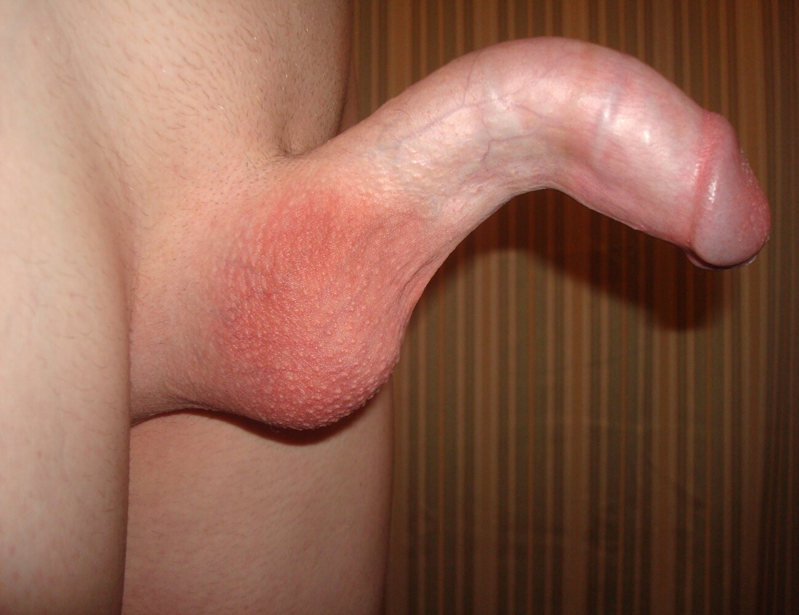

# Penile fracture

*Categories: Clinical knowledge > Urology > Urologic emergencies > Penile fracture*

[Original Article Link](https://coursology-qbank.com/amboss/article/Bi0zFf)

---

## Summary

Penile <u>fracture</u> refers to the traumatic rupture of the <u>tunica albuginea</u> and the <u>corpora cavernosa</u> of the <u>penis</u>. It is a rare condition that results from traumatic bending of the erect <u>penis</u>, typically during sexual intercourse or <u>masturbation</u>. Penile <u>fractures</u> usually present with <u>acute pain</u> and a cracking sound, accompanied by immediate loss of <u>erection</u>, as well as curving, swelling, and <u>hematoma</u> of the <u>penis</u>. In most cases, the diagnosis is established clinically, but imaging methods (e.g., <u>ultrasound</u>, <u>MRI</u>) may be needed in ambiguous cases. <u>Retrograde urethrography</u> is recommended in all cases of confirmed penile <u>fracture</u> to rule out concomitant urethral damage. Penile <u>fracture</u> is an acute urological emergency and requires immediate surgical treatment to avoid long-term complications, including abnormal curvature of the <u>penis</u> and <u>erectile dysfunction</u>.

---

## Definitions

* Traumatic rupture of the <u>tunica albuginea</u> and one or both of the <u>corpora cavernosa</u> of the erect <u>penis</u>

References:[[1]](https://coursology-qbank.com/amboss/article/ps0LDh)

---

## Etiology

* Traumatic bending of the erect <u>penis</u> 

* During sexual intercourse; most commonly occurs with the penetrative partner on top

* Aggressive <u>masturbation</u> methods

References:[[1]](https://coursology-qbank.com/amboss/article/ps0LDh)[[2]](https://coursology-qbank.com/amboss/article/mUYVdo)

---

## Clinical features

* Cracking, snapping, or popping sound caused by rupturing of the <u>tunica albuginea</u> and <u>soft tissue</u>

* Immediate <u>detumescence</u> (loss of <u>erection</u>)

* <u>Pain</u>; varies in intensity depending on severity of the injury

* Pronounced <u>soft tissue</u> swelling, curving, and <u>hematoma</u> of the <u>penis</u> (“eggplant” appearance)

* Blood at the urethral meatus, <u>urinary retention</u>, and/or <u>gross hematuria</u> in concomitant <u>urethral injury</u>

References:[[1]](https://coursology-qbank.com/amboss/article/ps0LDh)[[2]](https://coursology-qbank.com/amboss/article/mUYVdo)

---

## Diagnosis

The diagnosis of penile <u>fractures</u> is primarily clinical. Additional imaging is performed to diagnose ambiguous cases.

* <u>Retrograde urethrography</u>: performed if <u>urethral injury</u> is suspected before insertion of a transurethral indwelling catheter

* Imaging 

* <u>Ultrasound</u>: detection of <u>hematoma</u> and defects in the <u>tunica albuginea</u>

* Corpus cavernosography: detects injury of the <u>tunica albuginea</u>

* <u>MRI</u>: definitive exclusion of a <u>fracture</u>

References:[[1]](https://coursology-qbank.com/amboss/article/ps0LDh)

---

## Differential diagnoses

* Rupture of the <u>dorsal</u> <u>vein</u> of the <u>penis</u>

### Peyronie disease

* Definition: : fibroproliferative disorder that affects the <u>tunica albuginea</u> of the <u>penis</u>, causing abnormal curvature of the <u>penis</u>

* Pathogenesis: repeated penile microtrauma during sexual intercourse or athletic activity followed by abnormal wound healing → <u>fibrous plaque</u> formation [[3]](https://coursology-qbank.com/amboss/article/6cbjWs)

* Classification

* Active phase

* Acute or inflammatory phase

* Characterized by progressive penile deformity and painful <u>erection</u>

* Stable phase

* Chronic phase

* Characterized by the lack of progression of penile deformity and <u>pain</u>

* Clinical features

* Penile <u>pain</u>

* Penile <u>nodules</u>/indurations on the affected side of the <u>penis</u>

* <u>Erectile dysfunction</u> due to abnormal curvature of the <u>penis</u>

* Possibly associated with psychological conditions;  (e.g., <u>anxiety</u>, <u>depression</u>) [[4]](https://coursology-qbank.com/amboss/article/pcbLWs)

* Differential diagnosis

* Penile <u>fracture</u> (penile injury → rupture of <u>corpora cavernosa</u> → penile curvature)

* <u>Chordee</u> without <u>hypospadias</u>

* Treatment

* Active phase: oral <u>NSAIDs</u> or oral <u>pentoxifylline</u> for 3 months

* No symptomatic improvement: intralesional <u>collagenase</u> injections

* Symptomatic improvement: observation or continuation of oral <u>pentoxifylline</u> for another 6 months

* Stable phase

* Observation: patients with a mild penile curvature (< 30°) and no <u>erectile dysfunction</u>

* Intralesional <u>collagenase</u> injections: patients with penile curvature (> 30°) and/or <u>erectile dysfunction</u>

* Surgical repair: patients unresponsive to treatment, with severe penile deformity, and/or with extensive calcifications

Peyronie disease

References:[[1]](https://coursology-qbank.com/amboss/article/ps0LDh)

The differential diagnoses listed here are not exhaustive.

---

## Treatment

* Surgical procedure 

* Exploration of the <u>penis</u> with evacuation of <u>hematoma</u>

* Repair of possible <u>urethral injury</u> with insertion of a catheter for <u>stenting</u> purposes

* Suture of rupture in the <u>tunica albuginea</u>

* Postoperative measures

* <u>Pain</u> medication; prophylactic oral <u>antibiotics</u>

* Light compression dressing

* 4 weeks of sexual abstinence (suppression of spontaneous erections with <u>diazepam</u> or stilboestrol may be considered)

* Follow-up with <u>retrograde urethrography</u> in patients with urethral reconstruction upon removal of the urethral catheter after 2 weeks

> [!NOTE]
> Penile <u>fracture</u> is a urological emergency and requires immediate surgical treatment to restore functionality and minimize risk of long-term complications!

References:[[1]](https://coursology-qbank.com/amboss/article/ps0LDh)[[2]](https://coursology-qbank.com/amboss/article/mUYVdo)[[5]](https://coursology-qbank.com/amboss/article/Js0sDh)

---