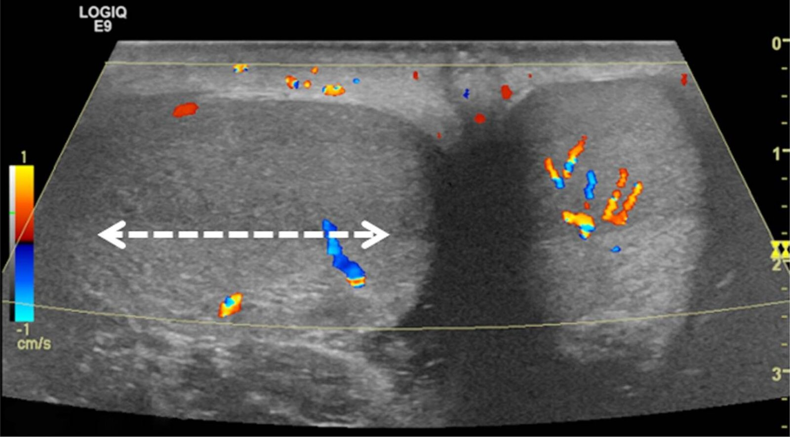

# Testicular torsion

*Categories: Clinical knowledge > Urology > Urologic emergencies > Testicular torsion*

[Original Article Link](https://coursology-qbank.com/amboss/article/Li0wHf)

---

## Summary

Testicular torsion is the sudden twisting of the <u>spermatic cord</u> within the <u>scrotum</u>. It most commonly affects <u>neonates</u> and young men. Because of the risk of <u>ischemia</u> and possible <u>infarction</u> of the <u>testis</u>, it is considered a urological emergency. Testicular torsion is characterized by sudden-onset unilateral testicular <u>pain</u>, which may radiate to the lower abdomen, with <u>nausea and vomiting</u>. Clinical findings include a high-riding <u>testis</u> with an absent <u>cremasteric reflex</u>. Imaging with <u>duplex ultrasound</u> of the <u>scrotum</u> may be required if the <u>clinical diagnosis</u> is in doubt. If testicular torsion is suspected, prompt surgical exploration within six hours of symptom onset is essential to salvage the <u>testis</u>. Important differential diagnoses, e.g., <u>orchitis</u> and <u>epididymitis</u>, should be ruled out before initiating treatment.

---

## Epidemiology

* Peak <u>incidence</u>: <u>neonatal period</u> (first 30 days of life) and during <u>puberty</u> (10–14 years) [[1]](https://coursology-qbank.com/amboss/article/fiXkIB)

* <u>Prevalence</u>

* 3.8 per 100,000 male individuals under 18 years of age (two-thirds of cases occur between 12 and 18 years of age) [[2]](https://coursology-qbank.com/amboss/article/cbbasH)

* Accounts for 10–15% of acute scrotal illness in children within the United States [[3]](https://coursology-qbank.com/amboss/article/q50COg)

Epidemiological data refers to the US, unless otherwise specified.

---

## Etiology

* <u>Idiopathic</u> [[3]](https://coursology-qbank.com/amboss/article/q50COg)

* Proposed causes include <u>bell clapper deformity</u> (<u>intravaginal torsion</u>; see "Pathophysiology" below) and a long <u>mesorchium</u>.

* In fetuses and <u>neonates</u>: <u>extravaginal torsion</u> of the entire <u>tunica vaginalis</u>

* <u>Iatrogenic</u>

* Occurs as a result of vigorous physical activity or trauma in very rare cases [[4]](https://coursology-qbank.com/amboss/article/G50Blg)

* Predisposing factors, especially in adults: testicular <u>malignancy</u>

---

## Pathophysiology

* Testicular torsion is a sudden twisting of the <u>spermatic cord</u> (and vascular pedicle) associated with a poorly secured <u>testis</u>.

* Three mechanisms of testicular torsion may be identified:

* Intravaginal torsion: hypotheses suggest this occurs because of a congenital abnormality in which the <u>tunica vaginalis</u> attaches to the superior pole of the <u>testis</u> (bell-clapper deformity) → increased mobility of <u>testis</u> within <u>tunica vaginalis</u>, with possible abnormal transverse lie of <u>testis</u> → torsion of the <u>testis</u> (along the <u>spermatic cord</u>) [[5]](https://coursology-qbank.com/amboss/article/VXbGCH)

* Extravaginal torsion: lack of fixation of the <u>tunica vaginalis</u> to the <u>gubernaculum</u> → concomitant torsion of the <u>testis</u> and <u>tunica vaginalis</u> (along the <u>spermatic cord</u>) [[6]](https://coursology-qbank.com/amboss/article/6jXjYy)

* Long <u>mesorchium</u> : elongated mesorchium (thick band of <u>connective tissue</u> between the efferent ductules of the <u>epididymis</u> and the <u>posterior</u> surface of the <u>testis</u>) → torsion of the <u>testis</u> along the <u>mesorchium</u> [[7]](https://coursology-qbank.com/amboss/article/KjXUYy)

* Torsion results in venous engorgement with consequent arterial compromise, tissue <u>ischemia</u>, and possible <u>infarction</u>.

* Irreversible damage occurs after 6–12 hours of torsion. [[3]](https://coursology-qbank.com/amboss/article/q50COg)

---

## Clinical features

* Abrupt onset of severe testicular <u>pain</u> and/or <u>pain</u> in the lower abdomen

* Typically swollen and tender <u>testis</u> and/or lower abdominal tenderness [[8]](https://coursology-qbank.com/amboss/article/I50Ylg)

* <u>Nausea and vomiting</u>

* Abnormal position of the <u>testis</u>

* Scrotal elevation (high-riding <u>testis</u>)

* Abnormal transverse position

* Possible <u>undescended testes</u> (predisposes to testicular torsion) [[9]](https://coursology-qbank.com/amboss/article/F50gNg)

* Absent <u>cremasteric reflex</u>

* Negative <u>Prehn sign</u>

* In <u>neonates</u> 

* Possible absent <u>testis</u>

* Firm, <u>painless scrotal mass</u>

* Possible <u>acute inflammation</u>: swollen, <u>erythematous</u> (or blue discolored in venous engorgement), and tender hemiscrotum

> [!WARNING]
> Sudden, severe, unilateral scrotal <u>pain</u> in a patient with a tender, abnormally positioned <u>testis</u> on examination should be managed as testicular torsion until proven otherwise.

References:[[3]](https://coursology-qbank.com/amboss/article/q50COg)

---

## Diagnosis

> [!TIP]
> Testicular torsion is typically a <u>clinical diagnosis</u>. Do not delay definitive treatment for diagnostic workup if clinical suspicion is high.

### Imaging

Imaging is not routinely indicated if there is high clinical suspicion but should be considered in patients with atypical clinical features.

#### <u>Duplex ultrasound</u> of the <u>scrotum</u> [[11]](https://coursology-qbank.com/amboss/article/IhcY2X0)[[14]](https://coursology-qbank.com/amboss/article/ZzYZr7)[[15]](https://coursology-qbank.com/amboss/article/0zYer7)[[16]](https://coursology-qbank.com/amboss/article/azYQr7)[[17]](https://coursology-qbank.com/amboss/article/rhcf2X0)

Either <u>formal ultrasound</u> or <u>POCUS</u> can be used to diagnose torsion, depending on operator skill and availability.  [[18]](https://coursology-qbank.com/amboss/article/Dhc1TX0)

* Indication: inconclusive clinical findings [[14]](https://coursology-qbank.com/amboss/article/ZzYZr7)

* Characteristic findings [[12]](https://coursology-qbank.com/amboss/article/35YSPp)[[16]](https://coursology-qbank.com/amboss/article/azYQr7)

* Enlarged <u>testis</u>

* Twisting of <u>spermatic cord</u> (<u>whirlpool sign</u>)

* Reduced or absent blood flow to/from the affected <u>testis</u>

* Heterogeneous appearance of testicular <u>parenchyma</u> indicates testicular <u>necrosis</u>.  [[16]](https://coursology-qbank.com/amboss/article/azYQr7)

Intermittent testicular torsion

#### Other imaging modalities

These are typically time-consuming studies and may not be readily available in emergency situations.

* <u>Radionuclide imaging</u> [[3]](https://coursology-qbank.com/amboss/article/q50COg)[[19]](https://coursology-qbank.com/amboss/article/2bbTGH)

* Indications

* Inconclusive clinical findings

* Evaluate for <u>epididymitis</u>

* Characteristic findings

* Testicular torsion

* Areas that do not absorb radionuclide as a result of decreased blood flow to the affected <u>testis</u> (“cold spots”)

* Asymmetric blood flow

* <u>Epididymitis</u>: areas of increased radionuclide absorption as a result of increased blood flow in inflammation (“hot spots”)

* <u>MRI</u> with IV contrast: may be used as an alternative to <u>radionuclide imaging</u> [[12]](https://coursology-qbank.com/amboss/article/35YSPp)

> [!TIP]
> Surgical intervention is recommended for suspected testicular torsion, regardless of radiological findings.

### <u>Laboratory studies</u>

* Not routinely indicated

* <u>Urinalysis</u> [[14]](https://coursology-qbank.com/amboss/article/ZzYZr7)

* Indications: rule out <u>epididymitis</u>

* Findings: <u>Leukocytes</u> and <u>erythrocytes</u> in the urine suggest <u>epididymitis</u> but do not exclude torsion (see “<u>Epididymitis</u>”).

---

## Treatment

Testicular torsion is a <u>medical emergency</u> and should ideally be treated within 6 hours of the onset of symptoms for the best chance of testicular salvage. Manual detorsion in the emergency department may be attempted prior to <u>surgery</u> for immediate <u>pain</u> relief, but should not delay transferring the patient to the operating room.

### Manual testicular detorsion [[3]](https://coursology-qbank.com/amboss/article/q50COg)[[12]](https://coursology-qbank.com/amboss/article/35YSPp)

* Indication: : may be attempted prior to <u>surgery</u> for immediate <u>pain</u> relief or if <u>surgery</u> is not immediately available

* Procedure

* Consider performing under <u>ultrasound</u> guidance to increase the likelihood of success.

* Rotate the <u>testis</u> laterally toward the thigh ; two-thirds of torsions occur toward the midline.

* If <u>lateral</u> rotation does not provide symptom relief, rotate the <u>testis</u> toward the midline; one-third of torsions occur laterally. [[21]](https://coursology-qbank.com/amboss/article/SYbyoH)

* <u>Surgery</u> should still be performed in all patients to resolve any possible degree of remaining torsion  and to prevent recurrence. [[14]](https://coursology-qbank.com/amboss/article/ZzYZr7)[[14]](https://coursology-qbank.com/amboss/article/ZzYZr7)

> [!TIP]
> Because of the risk of <u>infertility</u>, surgical exploration of the <u>scrotum</u> is recommended in any patient suspected of having testicular torsion, even if manual detorsion has been attempted.

Testicular torsion and manual detorsion

### Exploratory <u>surgery</u> [[3]](https://coursology-qbank.com/amboss/article/q50COg)[[14]](https://coursology-qbank.com/amboss/article/ZzYZr7)

* Indication: suspected testicular torsion

* Timing: ideally, within 6 hours of symptom onset  [[3]](https://coursology-qbank.com/amboss/article/q50COg)

* Procedure

* Immediate surgical exploration of the <u>scrotum</u> with reduction (untwisting) and <u>orchiopexy</u> of the affected <u>testis</u>

* <u>Orchiopexy</u> of the <u>contralateral</u> <u>testis</u> is recommended because the risk of testicular torsion on the <u>contralateral</u> side increases with previous or current testicular torsion. [[3]](https://coursology-qbank.com/amboss/article/q50COg)

* <u>Orchiectomy</u> if the <u>testis</u> is grossly <u>necrotic</u> or nonviable

---